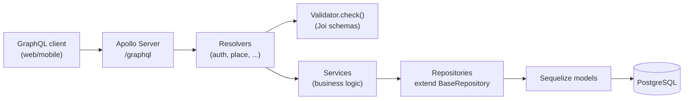
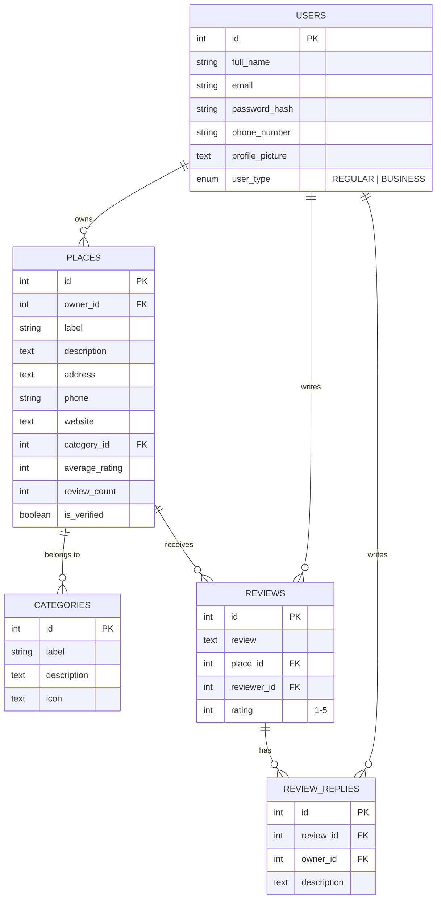

# Architecture

## Backend layering

The existing code already follows one consistent flow. Keep every new feature on this
same shape — it's the single most valuable thing to protect as the project grows:

Rules implied by the existing code, worth writing down so they stay rules instead of
accidents:
- **Resolvers** parse args, call `requireAuth`/`requireOwner`, validate input via
  `Validator.check(schema, input)`, delegate to a service, wrap the result in
  `SuccessResponse.send(...)`, and translate thrown errors into `GraphQLError`. They do
  not talk to models or repositories directly.
- **Services** hold business logic and orchestration (e.g. "does this place exist
  before I update it") and own the one repository they need. They return
  models/DTOs, not GraphQL-shaped envelopes.
- **Repositories** are the only layer that touches Sequelize. New repositories extend
  `BaseRepository<InputInterface, ModelInterface>` and add only the query methods a
  generic repo can't express — don't reimplement `findByPk`/`create`/etc.
- **Validators** are Joi schemas built from the shared primitives in `schemas.ts`.
  Every mutation input gets a schema, even a thin one.

## Why `@apollo/subgraph` / `buildSubgraphSchema`

`schema/index.ts` composes the graph with `buildSubgraphSchema([{typeDefs, resolvers}, ...])`
from `@apollo/subgraph` — this is Apollo Federation's subgraph API, normally used when
multiple independently-deployed services each own part of a graph behind a gateway.
Here it's being used with a single process and no gateway, purely as a way to let each
feature (`auth`, `place`, ...) `extend type Query`/`extend type Mutation` independently
and merge cleanly. That's a legitimate use and it's cheap to keep — but it's worth
being deliberate about it: if there's no near-term plan to split into real federated
services, a plain `makeExecutableSchema` from `@graphql-tools/schema` gives the same
"multiple files extend the root types" ergonomics without importing federation
semantics (`@key`, entity resolution, etc.) that aren't being used and could confuse
future contributors into thinking this is a federated architecture. Not urgent — just
flag it as an intentional-or-not decision worth confirming.

## Data model

### Current (implemented as migrations)

Every table above already has `created_at`/`updated_at`/`deleted_at` (soft delete)
via `paranoid: true` — keep that convention for every new table too, it's the reason
"delete" in the Figma designs (delete review, remove saved place, delete account) can
be a safe, reversible operation instead of a destructive one.

### Proposed additions (to satisfy the Figma scope — see doc 1's feature table)

```mermaid
erDiagram
    SAVED_PLACES {
        int id PK
        int user_id FK
        int place_id FK
        enum list_type "SAVED | WANT_TO_VISIT | FAVORITE"
    }
    REVIEW_VOTES {
        int id PK
        int review_id FK
        int user_id FK
        boolean helpful
    }
    NOTIFICATIONS {
        int id PK
        int user_id FK
        string type
        text payload
        boolean read
    }
    BADGES {
        int id PK
        string label
        text icon
        text criteria
    }
    USER_BADGES {
        int id PK
        int user_id FK
        int badge_id FK
        datetime earned_at
    }
    SESSIONS {
        int id PK
        int user_id FK
        string refresh_token_hash
        string device_label
        datetime last_used_at
        datetime revoked_at
    }
    PLACE_HOURS {
        int id PK
        int place_id FK
        int day_of_week
        time opens_at
        time closes_at
    }
    MEDIA {
        int id PK
        string owner_type "PLACE | REVIEW | USER"
        int owner_id
        text url
        string kind "PHOTO | AVATAR | COVER"
    }
```

Notes on the additions:
- **`SAVED_PLACES`** is the backing table for "Saved" tab, the heart-toggle on
  business cards, and the "Want to Visit / Favorites" filters — one table, `list_type`
  enum distinguishes the tab, avoids three separate join tables.
- **`REVIEW_VOTES`** backs the "helpful" vote count; store one row per (user, review)
  so a user can't vote twice, and derive the displayed count rather than storing a
  mutable counter that can drift.
- **`SESSIONS`** is what makes refresh-token revocation and the Settings "active
  sessions" list possible — store a hash of the refresh token, not the token itself.
- **`MEDIA`** is a single polymorphic table for the three places images show up
  (place photos, review photos, user avatar/cover) rather than three near-identical
  tables — pairs with an actual object-storage decision (see doc 6).
- Add `price_range` (`enum $/$$/$$$`) directly onto `PLACES` rather than a new table.

## `signUpBusiness` (atomic account + place creation)

**New scope, surfaced 2026-08-12** while designing Phase 4's Auth screens (see
[04-roadmap.md](./04-roadmap.md) Phase 4 and
[05-frontend-plan.md](./05-frontend-plan.md)'s "Business-owner signup" section).
**Done** (2026-08-13).

Business-owner signup needs to create the `User` (`userType: BUSINESS`) and their
first `Place` **atomically in one transaction**, not as two chained calls to the
existing `signUp` + `createPlace` mutations — chaining them risks a business-type
user left with no place if the caller drops off between steps. A new mutation,
`signUpBusiness`, does both:

- **Input**: the existing `InputAuthSignUp` fields minus `userType` (implied
  `BUSINESS`) — `name`, `email`, `password` — plus the place fields `createPlace`
  already takes: `label`, `description`, `address`, `phone`, `website`,
  `categoryId`, `priceRange`. Flat, not nested under a `place` key
  (`InputSignUpBusinessInterface`/`InputSignUpBusiness`).
- **Output**: `{ user, place, token }` (`SignUpBusinessResponse.data`) — not
  quite the same shape `signUp` claims to return (`signUp`'s `SignUpResponse.data`
  is typed `SignUpData{email,userType}` but the resolver actually returns
  `{user,token}` — a **pre-existing schema/resolver mismatch**, unrelated to this
  work and not touched here; `SignUpBusinessResponse.data` was typed to match
  what's actually returned, verified live).
- **Validator**: a new Joi schema (`signUpBusinessSchema`), per convention — not a
  thin wrapper around the two existing schemas, reusing the same field-level
  rules as `signUpSchema`/`createPlaceSchema` since this is a flat input, not a
  nested one.

**Architecture question resolved (2026-08-13)**: `CLAUDE.md`'s service rule is "own
exactly one repository each" — this mutation's orchestration spans two
repositories (`UserRepository`, `PlaceRepository`). No exception to that rule is
needed — `BaseRepository.create(input, options?: CreateOptions)` already accepts
Sequelize's `CreateOptions` (which includes `transaction`), and
`PlaceService.updateRatingStats` already threads an optional `transaction`
parameter through to its own repository, the exact shape `ReviewService`'s
`withTransaction`/`recomputePlaceStats` already uses to keep a review write and
`Place.averageRating`/`reviewCount` recomputation atomic. `signUpBusiness` reuses
that same pattern one level up, via a new orchestration-only
`BusinessOnboardingService` (no repository of its own, same shape as
`PlatformStatsService`) that composes `AuthService` and `PlaceService`:

1. **Extract user-creation out of `AuthService.signUp`.** `signUp` today bundles
   three things — validate email, create the `User` row, then sign tokens and
   create a session (a third repository write, via `SessionService`) — all before
   returning. Calling `signUp()` as a black box from `BusinessOnboardingService`
   would create the session *before* the `Place` exists and outside any shared
   transaction, so `User`+`Place` wouldn't actually be atomic. Instead, pull just
   the "check email doesn't exist, hash password, create the `User` row" step out
   into a new `AuthService` method (e.g. `createUser(input, transaction?:
   Transaction)`) that accepts an optional transaction and returns the created
   user, with no token-signing or session-creation inside it. `signUp()` itself is
   refactored to call this same method (without a transaction — it's a single
   write, doesn't need one) so there's exactly one code path for user creation,
   not two to keep in sync.
2. **`PlaceService.createPlace` gains an optional `transaction` parameter**,
   threaded straight to `repository.create(input, { transaction })` — same shape
   as `PlaceService.updateRatingStats` already has.
3. **`BusinessOnboardingService.signUpBusiness`**: check the email doesn't already
   exist (before opening a transaction, same as `ReviewService.createReview`'s
   checks happening before `withTransaction`), then open one transaction (reusing
   `ReviewService`'s `withTransaction` shape) covering exactly the two writes that
   must be atomic — `AuthService.createUser(..., transaction)` then
   `PlaceService.createPlace(input, transaction)`, using the newly-created user's
   id as the place's `ownerId`. **After** the transaction commits — same "re-fetch/
   follow-up happens after commit" rule `ReviewService.updateReview` already
   documents — sign tokens (`signToken`, a pure utility, not a repository) and
   create the session via the existing `SessionService`, then return `{ user,
   place, token }`. If place creation fails (e.g. an invalid `categoryId`), the
   transaction rolls back the user creation too — no orphaned business account,
   which is the exact failure mode this mutation exists to prevent.

**Verified live** (2026-08-13): happy path (user + place + session + tokens all
created, issued access token authenticates a follow-up `authMeUser` call);
rollback path (an out-of-range `categoryId` trips the `providers_places`
category FK, and the `User` row created moments earlier in the same transaction
is confirmed gone — a subsequent `login` with that email fails with "Invalid
email or password"); duplicate-email rejection (same as `signUp`'s existing
check, reused via `createUser`).

## Planned: `Category` cover image + live business-count/avg-rating

**New scope, surfaced 2026-08-12** while designing Phase 4's Categories screen
(see [04-roadmap.md](./04-roadmap.md) Phase 4) — reverses an earlier decision on
the same ticket to ship category cards without these fields, once matching the
Figma design exactly (cover photo + "N businesses · X★ avg" per card) turned out
to be what was actually wanted, not just a visual reference to loosely adapt.
**`coverImageUrl`, `businessCount`, and `avgRating` are now all built** (2026-08-13).

- ~~**`coverImageUrl: String`**~~ **Done.** New nullable `cover_image_url` column
  on `providers_category` (migration `20260813120000-add-cover-image-url-to-category.js`)
  + matching GraphQL field, resolved via default field resolution off the model
  instance (no field resolver needed). Categories are migration/seed-managed
  ("no mutations" per `CLAUDE.md`) and stay that way — no mutation was added.
  **Not yet seeded**: the field exists and resolves (verified `null` for every
  category via a live query) but no actual URLs have been set — populating real
  per-category images is a content decision, not part of this addition.

  **Category count fixed (2026-08-13)**: the seed data used to have only 5
  categories (Restaurant, Cafe, Bar, Hotel, Gym), not the 10 the Phase 4
  frontend design was built against. Fixed via a new seeder,
  `20260813130000-update-categories-to-figma-ten.js` — 4 of the 5 renamed in
  place (Restaurant→Restaurants, Cafe→Cafés, Hotel→Hotels, Gym→Fitness,
  preserving their ids so any existing `Place.categoryId` stays valid), `Bar`
  kept as an 11th category (no Figma counterpart, deliberately not deleted),
  plus 6 new categories (Shopping, Healthcare, Education, Beauty & Wellness,
  Entertainment, Professional Services). `icon` also switched meaning here:
  the original seed held flaticon.com image URLs, but every Phase 4 prototype
  (and the design-tokens research) uses lucide-react icon *names* instead — no
  real frontend consumed the old convention yet, so the whole table moved onto
  the one that's actually going to be built against.

  **Real issue found while doing this, not yet fixed**: this project's
  seeders aren't tracked/idempotent — `sequelize-cli db:seed:all` has no
  seed-storage config, so it **re-runs every seeder file every time**,
  regardless of whether it already ran. Running `npm run db:seed` after adding
  the new seeder above silently re-inserted 5 duplicate rows from the
  *original* `20260704104520-create-categories` seeder (cleaned up manually
  this time). Worth fixing properly before anyone else runs `db:seed` again —
  either a custom `seederStorage` config (sequelize-cli supports tracking
  seeders the same way it tracks migrations) or rewriting seeders to be
  idempotent (`findOrCreate`-style) rather than raw `bulkInsert`.
- ~~**`businessCount: Int` / `avgRating: Float`**~~ **Done.** Computed **live at
  query time**, not materialized/cached columns. This matches the *existing*
  precedent already set by `Place.averageRating`/`reviewCount`, which `CLAUDE.md`
  documents as "recomputed from source... never incrementally adjusted" — same
  philosophy applied one level up (categories aggregating over places, instead
  of places aggregating over reviews). Both `categories()` and `category(id)`
  resolve these fields — the category-detail screen's banner copy
  ("N businesses · X★ average rating") uses them too, not just the browse-grid
  cards.
- **Layering — implemented differently than originally planned below, still no
  exception needed.** Rather than a joined query living inside
  `CategoryRepository` (the plan when this section was first written), it's
  `PlaceRepository.getCategoryStats(categoryId)` — a `count()` + `aggregate()`
  pair (mirroring `ReviewRepository.getRatingStats`'s existing shape), called by
  `categoryResolver.ts`'s `Category.businessCount`/`avgRating` field resolvers
  directly via `PlaceService`. This follows the established convention (see
  `reviewResolver.ts`'s `Review.reviewer`/`place` field resolvers) that a field
  resolver calls whichever service *owns* the underlying data, not the parent
  type's "owning" service — `Category` doesn't gain a second repository, and
  `Place` data stays inside `PlaceRepository`/`PlaceService`. Uses Sequelize's
  typed `count`/`aggregate` API, not `rawQuery` — the ORM expresses this fine,
  same reasoning as `ReviewRepository.getRatingStats`.
- **Type note**: `CategoryInterface.id` is `string` (not `number`) — both
  `PlaceRepository.getCategoryStats` and `PlaceService.getCategoryStats` are
  typed `categoryId: number | string` to match, the same widening already
  applied to `Place.ratingBreakdown` below for `PlaceInterface.id`.
- **Open design note, worth being explicit about rather than silently picking
  one**: `avgRating` here is an *average of each place's already-averaged
  rating* (average-of-averages), not a true weighted average across every
  individual review in the category. Simpler to compute and matches what the
  Figma design almost certainly intended, but worth knowing it can diverge
  slightly from a places-weighted-by-review-count calculation if that precision
  ever matters later.

### Also needed: platform-wide stats (`totalPlaces`/`totalReviews`)

**Addendum, surfaced 2026-08-12** after this same ticket was reopened to restore
the Categories screen's "56,700+ Total Businesses / 10 Categories / 14M+
Reviews" stats row — same reasoning as above, but platform-wide rather than
per-category, so it doesn't fit inside `Category`.

**Done** (2026-08-13).

- A new top-level query, `platformStats: PlatformStatsResponse { data:
  { totalPlaces: Int, totalReviews: Int } }` — `totalPlaces` is `COUNT` over
  non-deleted `Place`, `totalReviews` is `COUNT` over non-deleted `Review`.
  "Categories" doesn't need this query at all — it's already real today via
  `categories().data.length`, no backend change for that number.
- Same **live, not materialized** philosophy as the rest of this doc. Built
  exactly as planned: a dedicated `PlatformStatsService` composing
  `PlaceService.countAll()` and `ReviewService.countAll()` (each a thin
  passthrough to `BaseRepository.count({})`) rather than adding a new
  cross-domain repository. Each repository still owns exactly one table's
  concerns; the service only orchestrates two independent reads, not a shared
  write transaction, so this doesn't carry the same complication
  `signUpBusiness` above does.
- **Wiring gotcha worth flagging**: `platformStatsTypedefs`/`platformStatsResolver`
  are barrel-exported from `typeDefs/index.ts`/`resolvers/index.ts`, but
  `src/graphql/schema/index.ts` builds the subgraph schema from its own
  explicit `{typeDefs, resolvers}` array — being barrel-exported doesn't
  register a new domain with `buildSubgraphSchema`. Verified live only after
  adding `{typeDefs: platformStatsTypedefs, resolvers: platformStatsResolver}`
  to that array; before that fix, the barrel exports existed and `npm run
  build` passed clean, but `platformStats` didn't resolve at runtime
  ("Cannot query field ... on type Query"). Worth remembering for any future
  new domain typedefs/resolver pair.

## Place Detail follow-ups (`ReviewReply.createdAt`, review sort, rating breakdown)

**New scope, surfaced 2026-08-13** while designing Phase 4's Place Detail screen
(ticket `06-place-detail-review.md`) against a real, complete Figma design for it.
Three small, independent additions. **All three are now built** (2026-08-13).

- ~~**`ReviewReply.createdAt: DateTime`**~~ **Done**, typed `String` not
  `DateTime` — this schema has no `DateTime` scalar anywhere (checked); every
  existing date field (`Session.createdAt`/`lastUsedAt`) is plain `String`, so
  `ReviewReply.createdAt` matches that convention instead of introducing a new
  one. The underlying row already had `created_at` (`ModelTimestampExtend`,
  `timestamps: true` + `underscored: true` on the model) — no migration needed,
  no field resolver needed either, resolves via GraphQL's default field
  resolution off the model instance exactly like `Session.createdAt` does.
  Verified live: renders as a raw epoch-millisecond string (e.g.
  `"1786588033234"`), not an ISO date string — confirmed this is `Session`'s
  existing behavior too, not a defect introduced here. A real frontend will
  need to `new Date(Number(createdAt))` to format it, same as it already has to
  for sessions.
- ~~**`placeReviews(placeId, first, after, sort: ReviewSortEnum)`**~~ **Done.** A
  new `ReviewSortEnum` (`RECENT`/`HELPFUL`) mirrors `PlaceService.COLUMN_SORTS`'s
  pattern on `listPlaces` — `ReviewService.REVIEW_SORTS` maps each enum value to
  a real, stored column: `RECENT` → `created_at DESC` (unchanged default),
  `HELPFUL` → `helpful_count DESC`. Same keyset cursor-pagination shape as
  before, just a caller-selectable ordering.
  - **Real discrepancy found and resolved**: this section originally assumed
    `helpfulCount` was already a real column ("`HELPFUL` by the existing
    `helpfulCount`") — it wasn't. `Review.helpfulCount` was a pure per-request
    live `COUNT` over `providers_review_votes`
    (`ReviewVoteService.getHelpfulCount`, called only from a `Review.helpfulCount`
    GraphQL field resolver), the same "always live, never a column" treatment
    as `Category.businessCount`/`avgRating`. That doesn't compose with keyset
    pagination's plain `WHERE`/`ORDER BY` on a real column — sorting on a
    computed aggregate hits the same problem `paginateByDistance` solved with a
    raw-SQL subquery for `NEAREST`.
  - **Resolved by materializing `helpful_count`** on `providers_reviews`
    (migration `20260813140000-add-helpful-count-to-reviews.js`, `INTEGER NOT
    NULL DEFAULT 0`) instead of going the raw-SQL-subquery route. This follows
    the *other* existing precedent — `Place.averageRating`/`reviewCount` are
    real, stored columns specifically because `listPlaces` needs to sort/filter
    on them, fully recomputed (never incrementally adjusted) on every write.
    `ReviewVoteService.toggle` now wraps the vote create/delete, the recount
    (`ReviewVoteRepository.countForReview`), and writing that count onto the
    `Review` row (`ReviewService.updateHelpfulCount`, a pure-write passthrough
    matching `PlaceService.updateRatingStats`'s shape) in one transaction, so
    the stored count can never drift from the actual vote rows. The old
    `Review.helpfulCount` field resolver and `ReviewVoteService.getHelpfulCount`
    were removed — no longer needed (and would've been redundant/wasteful) now
    that the field is a real column resolving via GraphQL's default field
    resolution off the model instance, same as `ReviewReply.createdAt`.
  - **Verified live**: RECENT (default) and explicit `sort: RECENT` both
    unchanged; `sort: HELPFUL` correctly reorders by vote count after casting
    votes from multiple accounts; keyset pagination continuity confirmed across
    a two-page walk under `HELPFUL` (no overlap/gap); the un-vote path
    correctly decrements the stored count.
- ~~**Rating breakdown**~~ **Done.** A per-place count of reviews at each star
  value (5★→1★), for a bar-chart-style breakdown on the detail page. Same
  "live, not materialized" treatment as `Place.averageRating` itself and as
  Categories' `businessCount`/`avgRating` above: `ReviewRepository.getRatingBreakdown`
  runs a single grouped query (`group: ['rating']` over that place's
  non-deleted `Review`s) via Sequelize's typed `fn`/`col` API — not
  `rawQuery` — same "prefer the ORM's typed API, only drop to raw SQL when it
  genuinely can't express something" rule `paginateByDistance`'s Haversine
  query is the actual exception to. Exposed as `Place.ratingBreakdown:
  [RatingBreakdownEntry]` (`{ stars: Int, count: Int }`), resolved in
  `placeResolver.ts`'s `Place: {...}` block by calling `ReviewService`
  directly (same "field resolver calls whichever service owns the data"
  convention as `Category.businessCount`/`avgRating` above). Postgres returns
  no row at all for a star value with zero reviews — the repository method
  fills in the full 5..1 range with zero counts so callers don't have to.
  **Type note**: `PlaceInterface.id` is `string`, so `getRatingBreakdown` is
  typed `placeId: number | string` throughout (repository, service), matching
  the existing `PlaceHourService.getForPlace`/`isOpenNow` convention for the
  same situation.

## GraphQL schema design principles going forward

- **One `typeDefs`/`resolvers` pair per domain concept**, `extend type Query`/`Mutation`
  from each, composed in `schema/index.ts` — already the pattern, just keep doing it
  for `category`, `review`, `saved`, `notification`, etc.
- **Every field a screen needs should resolve through GraphQL, not bespoke REST.** The
  Figma dashboards (KPI cards, charts, sentiment breakdown) are read-heavy aggregation
  queries — model them as GraphQL queries with dedicated response types
  (`BusinessDashboardResponse`) backed by service-layer aggregation, not by having the
  frontend stitch together three separate queries.
- **Use the `PageInfoInterface`/`edges` shape that already exists** in
  `SuccessResponse` for any list endpoint (Discover feed, notifications, reviews) —
  it's already half-built, don't invent a second pagination convention.
- **Keep resource-ownership checks in the service layer**, next to the fetch that
  proves the resource exists (fixes issue #2 in doc 2 and prevents it from recurring
  in `review`/`review_reply` resolvers, which have the exact same shape).
