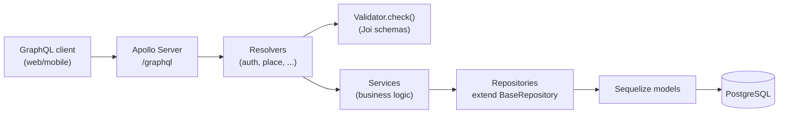
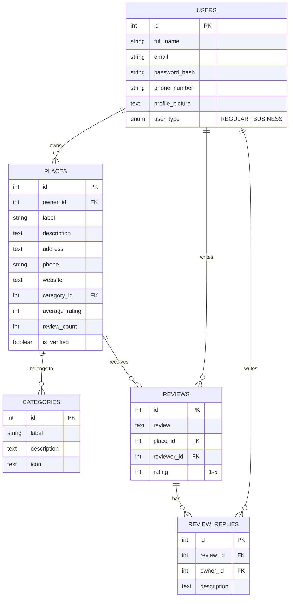

# Architecture

## Backend layering

The existing code already follows one consistent flow. Keep every new feature on this
same shape — it's the single most valuable thing to protect as the project grows:

Rules implied by the existing code, worth writing down so they stay rules instead of
accidents:
- **Resolvers** parse args, call `requireAuth`/`requireOwner`, validate input via
  `Validator.check(schema, input)`, delegate to a service, wrap the result in
  `SuccessResponse.send(...)`, and translate thrown errors into `GraphQLError`. They do
  not talk to models or repositories directly.
- **Services** hold business logic and orchestration (e.g. "does this place exist
  before I update it") and own the one repository they need. They return
  models/DTOs, not GraphQL-shaped envelopes.
- **Repositories** are the only layer that touches Sequelize. New repositories extend
  `BaseRepository<InputInterface, ModelInterface>` and add only the query methods a
  generic repo can't express — don't reimplement `findByPk`/`create`/etc.
- **Validators** are Joi schemas built from the shared primitives in `schemas.ts`.
  Every mutation input gets a schema, even a thin one.

## Why `@apollo/subgraph` / `buildSubgraphSchema`

`schema/index.ts` composes the graph with `buildSubgraphSchema([{typeDefs, resolvers}, ...])`
from `@apollo/subgraph` — this is Apollo Federation's subgraph API, normally used when
multiple independently-deployed services each own part of a graph behind a gateway.
Here it's being used with a single process and no gateway, purely as a way to let each
feature (`auth`, `place`, ...) `extend type Query`/`extend type Mutation` independently
and merge cleanly. That's a legitimate use and it's cheap to keep — but it's worth
being deliberate about it: if there's no near-term plan to split into real federated
services, a plain `makeExecutableSchema` from `@graphql-tools/schema` gives the same
"multiple files extend the root types" ergonomics without importing federation
semantics (`@key`, entity resolution, etc.) that aren't being used and could confuse
future contributors into thinking this is a federated architecture. Not urgent — just
flag it as an intentional-or-not decision worth confirming.

## Data model

### Current (implemented as migrations)

Every table above already has `created_at`/`updated_at`/`deleted_at` (soft delete)
via `paranoid: true` — keep that convention for every new table too, it's the reason
"delete" in the Figma designs (delete review, remove saved place, delete account) can
be a safe, reversible operation instead of a destructive one.

### Proposed additions (to satisfy the Figma scope — see doc 1's feature table)

Notes on the additions:
- **`SAVED_PLACES`** is the backing table for "Saved" tab, the heart-toggle on
  business cards, and the "Want to Visit / Favorites" filters — one table, `list_type`
  enum distinguishes the tab, avoids three separate join tables.
- **`REVIEW_VOTES`** backs the "helpful" vote count; store one row per (user, review)
  so a user can't vote twice, and derive the displayed count rather than storing a
  mutable counter that can drift.
- **`SESSIONS`** is what makes refresh-token revocation and the Settings "active
  sessions" list possible — store a hash of the refresh token, not the token itself.
- **`MEDIA`** is a single polymorphic table for the three places images show up
  (place photos, review photos, user avatar/cover) rather than three near-identical
  tables — pairs with an actual object-storage decision (see doc 6). **Built**
  (Phase 8, avatar/cover only so far) — see below.
- Add `price_range` (`enum $/$$/$$$`) directly onto `PLACES` rather than a new table.

## `signUpBusiness` (atomic account + place creation)

**New scope, surfaced 2026-08-12** while designing Phase 4's Auth screens (see
[04-roadmap.md](./04-roadmap.md) Phase 4 and
[05-frontend-plan.md](./05-frontend-plan.md)'s "Business-owner signup" section).
**Done** (2026-08-13).

Business-owner signup needs to create the `User` (`userType: BUSINESS`) and their
first `Place` **atomically in one transaction**, not as two chained calls to the
existing `signUp` + `createPlace` mutations — chaining them risks a business-type
user left with no place if the caller drops off between steps. A new mutation,
`signUpBusiness`, does both:

- **Input**: the existing `InputAuthSignUp` fields minus `userType` (implied
  `BUSINESS`) — `name`, `email`, `password` — plus the place fields `createPlace`
  already takes: `label`, `description`, `address`, `phone`, `website`,
  `categoryId`, `priceRange`. Flat, not nested under a `place` key
  (`InputSignUpBusinessInterface`/`InputSignUpBusiness`).
- **Output**: `{ user, place, token }` (`SignUpBusinessResponse.data`) — not
  quite the same shape `signUp` claims to return (`signUp`'s `SignUpResponse.data`
  is typed `SignUpData{email,userType}` but the resolver actually returns
  `{user,token}` — a **pre-existing schema/resolver mismatch**, unrelated to this
  work and not touched here; `SignUpBusinessResponse.data` was typed to match
  what's actually returned, verified live).
- **Validator**: a new Joi schema (`signUpBusinessSchema`), per convention — not a
  thin wrapper around the two existing schemas, reusing the same field-level
  rules as `signUpSchema`/`createPlaceSchema` since this is a flat input, not a
  nested one.

**Architecture question resolved (2026-08-13)**: `CLAUDE.md`'s service rule is "own
exactly one repository each" — this mutation's orchestration spans two
repositories (`UserRepository`, `PlaceRepository`). No exception to that rule is
needed — `BaseRepository.create(input, options?: CreateOptions)` already accepts
Sequelize's `CreateOptions` (which includes `transaction`), and
`PlaceService.updateRatingStats` already threads an optional `transaction`
parameter through to its own repository, the exact shape `ReviewService`'s
`withTransaction`/`recomputePlaceStats` already uses to keep a review write and
`Place.averageRating`/`reviewCount` recomputation atomic. `signUpBusiness` reuses
that same pattern one level up, via a new orchestration-only
`BusinessOnboardingService` (no repository of its own, same shape as
`PlatformStatsService`) that composes `AuthService` and `PlaceService`:

1. **Extract user-creation out of `AuthService.signUp`.** `signUp` today bundles
   three things — validate email, create the `User` row, then sign tokens and
   create a session (a third repository write, via `SessionService`) — all before
   returning. Calling `signUp()` as a black box from `BusinessOnboardingService`
   would create the session *before* the `Place` exists and outside any shared
   transaction, so `User`+`Place` wouldn't actually be atomic. Instead, pull just
   the "check email doesn't exist, hash password, create the `User` row" step out
   into a new `AuthService` method (e.g. `createUser(input, transaction?:
   Transaction)`) that accepts an optional transaction and returns the created
   user, with no token-signing or session-creation inside it. `signUp()` itself is
   refactored to call this same method (without a transaction — it's a single
   write, doesn't need one) so there's exactly one code path for user creation,
   not two to keep in sync.
2. **`PlaceService.createPlace` gains an optional `transaction` parameter**,
   threaded straight to `repository.create(input, { transaction })` — same shape
   as `PlaceService.updateRatingStats` already has.
3. **`BusinessOnboardingService.signUpBusiness`**: check the email doesn't already
   exist (before opening a transaction, same as `ReviewService.createReview`'s
   checks happening before `withTransaction`), then open one transaction (reusing
   `ReviewService`'s `withTransaction` shape) covering exactly the two writes that
   must be atomic — `AuthService.createUser(..., transaction)` then
   `PlaceService.createPlace(input, transaction)`, using the newly-created user's
   id as the place's `ownerId`. **After** the transaction commits — same "re-fetch/
   follow-up happens after commit" rule `ReviewService.updateReview` already
   documents — sign tokens (`signToken`, a pure utility, not a repository) and
   create the session via the existing `SessionService`, then return `{ user,
   place, token }`. If place creation fails (e.g. an invalid `categoryId`), the
   transaction rolls back the user creation too — no orphaned business account,
   which is the exact failure mode this mutation exists to prevent.

**Verified live** (2026-08-13): happy path (user + place + session + tokens all
created, issued access token authenticates a follow-up `authMeUser` call);
rollback path (an out-of-range `categoryId` trips the `providers_places`
category FK, and the `User` row created moments earlier in the same transaction
is confirmed gone — a subsequent `login` with that email fails with "Invalid
email or password"); duplicate-email rejection (same as `signUp`'s existing
check, reused via `createUser`).

**Two pre-existing bugs found and fixed while building the real Auth screens
against this** (2026-08-13, not new scope):
- **`SignUpResponse.data`** was typed `SignUpData{email, userType}`, but
  `AuthService.signUp` (and `authResolver.ts`'s resolver) has always returned
  `{user, token}` — the same shape `LoginResponse.data`/`SignUpBusinessResponse.data`
  use. Fixed by retyping `SignUpResponse.data: UserData` (reusing the same type
  `LoginResponse` already uses) — no resolver change needed, purely a GraphQL SDL
  fix. Without it, a REGULAR `signUp` had no way to get tokens back from the
  signup call itself.
- **`signUpSchema`/`signUpBusinessSchema`'s password field was missing
  `.min(8)`** despite both schemas' own Joi `messages` explicitly claiming
  "Password should be at least 8 characters." — a password of any length
  (even 1 character) passed validation. Added `.min(8)` to both, matching what
  the messages already asserted.

## Planned: `Category` cover image + live business-count/avg-rating

**New scope, surfaced 2026-08-12** while designing Phase 4's Categories screen
(see [04-roadmap.md](./04-roadmap.md) Phase 4) — reverses an earlier decision on
the same ticket to ship category cards without these fields, once matching the
Figma design exactly (cover photo + "N businesses · X★ avg" per card) turned out
to be what was actually wanted, not just a visual reference to loosely adapt.
**`coverImageUrl`, `businessCount`, and `avgRating` are now all built** (2026-08-13).

- ~~**`coverImageUrl: String`**~~ **Done.** New nullable `cover_image_url` column
  on `providers_category` (migration `20260813120000-add-cover-image-url-to-category.js`)
  + matching GraphQL field, resolved via default field resolution off the model
  instance (no field resolver needed). Categories are migration/seed-managed
  ("no mutations" per `CLAUDE.md`) and stay that way — no mutation was added.
  **Not yet seeded**: the field exists and resolves (verified `null` for every
  category via a live query) but no actual URLs have been set — populating real
  per-category images is a content decision, not part of this addition.

  **Category count fixed (2026-08-13)**: the seed data used to have only 5
  categories (Restaurant, Cafe, Bar, Hotel, Gym), not the 10 the Phase 4
  frontend design was built against. Fixed via a new seeder,
  `20260813130000-update-categories-to-figma-ten.js` — 4 of the 5 renamed in
  place (Restaurant→Restaurants, Cafe→Cafés, Hotel→Hotels, Gym→Fitness,
  preserving their ids so any existing `Place.categoryId` stays valid), `Bar`
  kept as an 11th category (no Figma counterpart, deliberately not deleted),
  plus 6 new categories (Shopping, Healthcare, Education, Beauty & Wellness,
  Entertainment, Professional Services). `icon` also switched meaning here:
  the original seed held flaticon.com image URLs, but every Phase 4 prototype
  (and the design-tokens research) uses lucide-react icon *names* instead — no
  real frontend consumed the old convention yet, so the whole table moved onto
  the one that's actually going to be built against.

  **Real issue found while doing this, not yet fixed**: this project's
  seeders aren't tracked/idempotent — `sequelize-cli db:seed:all` has no
  seed-storage config, so it **re-runs every seeder file every time**,
  regardless of whether it already ran. Running `npm run db:seed` after adding
  the new seeder above silently re-inserted 5 duplicate rows from the
  *original* `20260704104520-create-categories` seeder (cleaned up manually
  this time). Worth fixing properly before anyone else runs `db:seed` again —
  either a custom `seederStorage` config (sequelize-cli supports tracking
  seeders the same way it tracks migrations) or rewriting seeders to be
  idempotent (`findOrCreate`-style) rather than raw `bulkInsert`.
- ~~**`businessCount: Int` / `avgRating: Float`**~~ **Done.** Computed **live at
  query time**, not materialized/cached columns. This matches the *existing*
  precedent already set by `Place.averageRating`/`reviewCount`, which `CLAUDE.md`
  documents as "recomputed from source... never incrementally adjusted" — same
  philosophy applied one level up (categories aggregating over places, instead
  of places aggregating over reviews). Both `categories()` and `category(id)`
  resolve these fields — the category-detail screen's banner copy
  ("N businesses · X★ average rating") uses them too, not just the browse-grid
  cards.
- **Layering — implemented differently than originally planned below, still no
  exception needed.** Rather than a joined query living inside
  `CategoryRepository` (the plan when this section was first written), it's
  `PlaceRepository.getCategoryStats(categoryId)` — a `count()` + `aggregate()`
  pair (mirroring `ReviewRepository.getRatingStats`'s existing shape), called by
  `categoryResolver.ts`'s `Category.businessCount`/`avgRating` field resolvers
  directly via `PlaceService`. This follows the established convention (see
  `reviewResolver.ts`'s `Review.reviewer`/`place` field resolvers) that a field
  resolver calls whichever service *owns* the underlying data, not the parent
  type's "owning" service — `Category` doesn't gain a second repository, and
  `Place` data stays inside `PlaceRepository`/`PlaceService`. Uses Sequelize's
  typed `count`/`aggregate` API, not `rawQuery` — the ORM expresses this fine,
  same reasoning as `ReviewRepository.getRatingStats`.
- **Type note**: `CategoryInterface.id` is `string` (not `number`) — both
  `PlaceRepository.getCategoryStats` and `PlaceService.getCategoryStats` are
  typed `categoryId: number | string` to match, the same widening already
  applied to `Place.ratingBreakdown` below for `PlaceInterface.id`.
- **Open design note, worth being explicit about rather than silently picking
  one**: `avgRating` here is an *average of each place's already-averaged
  rating* (average-of-averages), not a true weighted average across every
  individual review in the category. Simpler to compute and matches what the
  Figma design almost certainly intended, but worth knowing it can diverge
  slightly from a places-weighted-by-review-count calculation if that precision
  ever matters later.

### Also needed: platform-wide stats (`totalPlaces`/`totalReviews`)

**Addendum, surfaced 2026-08-12** after this same ticket was reopened to restore
the Categories screen's "56,700+ Total Businesses / 10 Categories / 14M+
Reviews" stats row — same reasoning as above, but platform-wide rather than
per-category, so it doesn't fit inside `Category`.

**Done** (2026-08-13).

- A new top-level query, `platformStats: PlatformStatsResponse { data:
  { totalPlaces: Int, totalReviews: Int } }` — `totalPlaces` is `COUNT` over
  non-deleted `Place`, `totalReviews` is `COUNT` over non-deleted `Review`.
  "Categories" doesn't need this query at all — it's already real today via
  `categories().data.length`, no backend change for that number.
- Same **live, not materialized** philosophy as the rest of this doc. Built
  exactly as planned: a dedicated `PlatformStatsService` composing
  `PlaceService.countAll()` and `ReviewService.countAll()` (each a thin
  passthrough to `BaseRepository.count({})`) rather than adding a new
  cross-domain repository. Each repository still owns exactly one table's
  concerns; the service only orchestrates two independent reads, not a shared
  write transaction, so this doesn't carry the same complication
  `signUpBusiness` above does.
- **Wiring gotcha worth flagging**: `platformStatsTypedefs`/`platformStatsResolver`
  are barrel-exported from `typeDefs/index.ts`/`resolvers/index.ts`, but
  `backend/src/graphql/schema/index.ts` builds the subgraph schema from its own
  explicit `{typeDefs, resolvers}` array — being barrel-exported doesn't
  register a new domain with `buildSubgraphSchema`. Verified live only after
  adding `{typeDefs: platformStatsTypedefs, resolvers: platformStatsResolver}`
  to that array; before that fix, the barrel exports existed and `npm run
  build` passed clean, but `platformStats` didn't resolve at runtime
  ("Cannot query field ... on type Query"). Worth remembering for any future
  new domain typedefs/resolver pair.

## Place Detail follow-ups (`ReviewReply.createdAt`, review sort, rating breakdown)

**New scope, surfaced 2026-08-13** while designing Phase 4's Place Detail screen
(ticket `06-place-detail-review.md`) against a real, complete Figma design for it.
Three small, independent additions. **All three are now built** (2026-08-13).

- ~~**`ReviewReply.createdAt: DateTime`**~~ **Done**, typed `String` not
  `DateTime` — this schema has no `DateTime` scalar anywhere (checked); every
  existing date field (`Session.createdAt`/`lastUsedAt`) is plain `String`, so
  `ReviewReply.createdAt` matches that convention instead of introducing a new
  one. The underlying row already had `created_at` (`ModelTimestampExtend`,
  `timestamps: true` + `underscored: true` on the model) — no migration needed,
  no field resolver needed either, resolves via GraphQL's default field
  resolution off the model instance exactly like `Session.createdAt` does.
  Verified live: renders as a raw epoch-millisecond string (e.g.
  `"1786588033234"`), not an ISO date string — confirmed this is `Session`'s
  existing behavior too, not a defect introduced here. A real frontend will
  need to `new Date(Number(createdAt))` to format it, same as it already has to
  for sessions.
- ~~**`placeReviews(placeId, first, after, sort: ReviewSortEnum)`**~~ **Done.** A
  new `ReviewSortEnum` (`RECENT`/`HELPFUL`) mirrors `PlaceService.COLUMN_SORTS`'s
  pattern on `listPlaces` — `ReviewService.REVIEW_SORTS` maps each enum value to
  a real, stored column: `RECENT` → `created_at DESC` (unchanged default),
  `HELPFUL` → `helpful_count DESC`. Same keyset cursor-pagination shape as
  before, just a caller-selectable ordering.
  - **Real discrepancy found and resolved**: this section originally assumed
    `helpfulCount` was already a real column ("`HELPFUL` by the existing
    `helpfulCount`") — it wasn't. `Review.helpfulCount` was a pure per-request
    live `COUNT` over `providers_review_votes`
    (`ReviewVoteService.getHelpfulCount`, called only from a `Review.helpfulCount`
    GraphQL field resolver), the same "always live, never a column" treatment
    as `Category.businessCount`/`avgRating`. That doesn't compose with keyset
    pagination's plain `WHERE`/`ORDER BY` on a real column — sorting on a
    computed aggregate hits the same problem `paginateByDistance` solved with a
    raw-SQL subquery for `NEAREST`.
  - **Resolved by materializing `helpful_count`** on `providers_reviews`
    (migration `20260813140000-add-helpful-count-to-reviews.js`, `INTEGER NOT
    NULL DEFAULT 0`) instead of going the raw-SQL-subquery route. This follows
    the *other* existing precedent — `Place.averageRating`/`reviewCount` are
    real, stored columns specifically because `listPlaces` needs to sort/filter
    on them, fully recomputed (never incrementally adjusted) on every write.
    `ReviewVoteService.toggle` now wraps the vote create/delete, the recount
    (`ReviewVoteRepository.countForReview`), and writing that count onto the
    `Review` row (`ReviewService.updateHelpfulCount`, a pure-write passthrough
    matching `PlaceService.updateRatingStats`'s shape) in one transaction, so
    the stored count can never drift from the actual vote rows. The old
    `Review.helpfulCount` field resolver and `ReviewVoteService.getHelpfulCount`
    were removed — no longer needed (and would've been redundant/wasteful) now
    that the field is a real column resolving via GraphQL's default field
    resolution off the model instance, same as `ReviewReply.createdAt`.
  - **Verified live**: RECENT (default) and explicit `sort: RECENT` both
    unchanged; `sort: HELPFUL` correctly reorders by vote count after casting
    votes from multiple accounts; keyset pagination continuity confirmed across
    a two-page walk under `HELPFUL` (no overlap/gap); the un-vote path
    correctly decrements the stored count.
- ~~**Rating breakdown**~~ **Done.** A per-place count of reviews at each star
  value (5★→1★), for a bar-chart-style breakdown on the detail page. Same
  "live, not materialized" treatment as `Place.averageRating` itself and as
  Categories' `businessCount`/`avgRating` above: `ReviewRepository.getRatingBreakdown`
  runs a single grouped query (`group: ['rating']` over that place's
  non-deleted `Review`s) via Sequelize's typed `fn`/`col` API — not
  `rawQuery` — same "prefer the ORM's typed API, only drop to raw SQL when it
  genuinely can't express something" rule `paginateByDistance`'s Haversine
  query is the actual exception to. Exposed as `Place.ratingBreakdown:
  [RatingBreakdownEntry]` (`{ stars: Int, count: Int }`), resolved in
  `placeResolver.ts`'s `Place: {...}` block by calling `ReviewService`
  directly (same "field resolver calls whichever service owns the data"
  convention as `Category.businessCount`/`avgRating` above). Postgres returns
  no row at all for a star value with zero reviews — the repository method
  fills in the full 5..1 range with zero counts so callers don't have to.
  **Type note**: `PlaceInterface.id` is `string`, so `getRatingBreakdown` is
  typed `placeId: number | string` throughout (repository, service), matching
  the existing `PlaceHourService.getForPlace`/`isOpenNow` convention for the
  same situation.

**One more gap found while building the real Place Detail screen (2026-08-13),
same class as `ReviewReply.createdAt` above but on `Review` itself**:
`Review` had no `createdAt` field exposed in GraphQL at all — the model has
always had the column (`ModelTimestampExtend`/`timestamps: true`, same as
every table), but nothing surfaced it, so review dates couldn't be shown even
though `placeReviews`' `RECENT` sort already ordered by it server-side. Added
`createdAt: String` to the `Review` type — no resolver needed, resolves via
default field resolution off the model instance, same raw
epoch-millisecond-string convention as `Session.createdAt`/`ReviewReply.createdAt`.

## `Place.category`/`trendingScore` bugs found while building Discover (2026-08-13)

Two pre-existing gaps surfaced and fixed while building the real Discover
screen against the live API (not new scope):

- **`Place.category` had no field resolver at all.** The type declared
  `category: String`, but `placeResolver.ts`'s `Place: {...}` block never
  defined one, and the model has `categoryId`, not `category` — GraphQL's
  default field resolution silently returned `null` for every place, always.
  Fixed by retyping to `category: Category` (a full nested object, matching
  the `owner: User` field-resolver pattern already established for a
  foreign-key relationship) and adding a resolver that calls
  `CategoryService.getById(parent.categoryId)` — guarded against
  `categoryId` being unset (`InputPlaceInterface.categoryId` is optional),
  since `CategoryService.getById` throws `NOT_FOUND` for a missing id and an
  uncategorized place would otherwise 404 the entire containing `listPlaces`
  response.
- **`Place.trendingScore` was never exposed in GraphQL**, despite being a
  real materialized column (`docs/08-trending-strategy.md`) that Discover's
  "Trending" badge and strip both depend on. Added `trendingScore: Float` to
  the `Place` type — resolves via default field resolution off the model
  instance, no resolver needed, same as `isVerified`.

Both verified live via direct `listPlaces` queries before being wired into
the frontend.

## Built: Business Dashboard aggregation (Phase 6, 2026-08-15)

Full design in [specs/phase-6-business-dashboard.md](./specs/phase-6-business-dashboard.md).
One new query, `businessDashboard: BusinessDashboardResponse` — no args, derives the
caller's place from `context.user.id` (`requireOwner`), same "no caller-supplied id"
choice `myReviews` already made. **No new tables/migrations** — everything derives
from `providers_reviews` + `providers_reviews_replies`, already fully populated.

- **Orchestration-only service, no repository of its own** — `BusinessDashboardService`
  composes `PlaceService`/`ReviewService`/`ReviewReplyService` (each gained one thin
  passthrough method: `getByOwnerId`, `getForDashboard`, `getForReviews`), same shape
  as `PlatformStatsService`.
- **Two lightweight queries, everything else computed in memory** — fetches
  `{id, rating, createdAt}` for every review on the place and `{reviewId, createdAt}`
  for every reply, then a pure module (`businessDashboardMath.ts`, zero I/O) derives
  the reputation score, monthly rating/volume buckets (12 months, zero/null-filled —
  same gap-filling precedent as `ReviewRepository.getRatingBreakdown`), sentiment
  breakdown, response rate, and all four KPI trend deltas. Chosen over N separate SQL
  aggregate queries for simplicity given MVP review volume — same "start simple" call
  as My Reviews' client-side stats.
- **Reputation score**: weighted composite (55% rating, 20% volume via a log-scaled
  confidence curve, 15% response rate, 10% recency) — the spec has the full formula
  and rationale. Trend deltas (all four KPIs) work by re-running the same pure
  aggregation function against the dataset filtered to "as of the end of last month"
  and diffing against the live result — one function, two calls, no historical
  snapshots stored.
- **Sentiment breakdown is a rating-bucket heuristic** (4-5★ positive / 3★ neutral /
  1-2★ negative), not real NLP — the Figma Make source's "analysed via NLP" copy was
  explicitly not carried over, no such dependency exists in this project.
- **Review management reuses Phase 4 Place Detail's `ReviewCard` component and its
  existing `placeReviews`/`createReviewReply` operations verbatim** — no new review
  UI or mutations were built. The dashboard's "Needs Response"/"All Reviews" tabs
  filter the same `placeReviews(sort: RECENT)` result client-side.
- **Frontend nav**: reverses Phase 4's "identical shell for both user types"
  decision — `BUSINESS` accounts get their own nav (just Dashboard) instead of the
  reviewer nav (Discover/Categories/My Reviews) with Dashboard appended, since those
  are reviewer-persona features with no tie to managing a business listing
  (`frontend/src/routes/app/AppLayout.tsx`). A `BUSINESS` account hitting a
  reviewer-only path directly gets redirected to `/app/dashboard`; `/app/places/:id`
  stays reachable since the Dashboard's "View Listing" link depends on it.

Verified live: `businessDashboard` exercised directly via GraphQL as a fresh
zero-review BUSINESS account (confirmed 12 zero/null-filled months, zero-state
insight copy) and again after adding reviews/a reply (confirmed the reputation-score
arithmetic, sentiment percentages, and response-rate math by hand); `requireOwner`
gating confirmed to 403 a REGULAR account and 401 an unauthenticated request. Full
screen click-tested in-browser as a BUSINESS account, including the reply flow
(KPI/response-rate/reputation-score numbers and the "Needs Response" count all
updated live after posting a reply) and confirmed the Dashboard nav item is absent
for a REGULAR account.

## Built: Business console pages (Phase 6, 2026-08-15)

Full design in [specs/phase-6-business-console.md](./specs/phase-6-business-console.md).
The five remaining nav destinations the Business Dashboard shell already linked to
(`frontend/src/routes/app/AppLayout.tsx`'s `BUSINESS_NAV_ITEMS`, all placeholder
"under construction" screens until now): My Listing, Reviews, Analytics, Promotions,
Settings. **Zero backend changes** — every mutation/query these five pages needed
already existed from Phase 2/Phase 4/Phase 6's Dashboard work; this was a pure
frontend build, reconciled per-page against real capability:

- **My Listing** (`frontend/src/routes/app/myListing/`) — fully real. Edit form +
  live preview card, backed by the existing `updatePlace`/`setPlaceHours` mutations
  and `getPlaceById`/`categories` queries. Hours use native `<input type="time">`
  (simpler than the Figma mock's custom 30-minute-increment dropdown, same "HH:mm"
  wire format `setPlaceHours` already expects). No photo/logo uploader — no media
  infrastructure exists yet (Phase 8) — the preview shows an explicit "Photo uploads
  coming soon" placeholder instead.
- **Reviews** (`frontend/src/routes/app/reviews/`) — fully real. A fuller version of
  the Dashboard's review list: stats strip (total/average/awaiting-reply), sort
  (reuses the real `ReviewSortEnum.HELPFUL`/`RECENT`, not a client-side rating sort
  like the Figma mock), filter, client-side pagination. Same `ReviewCard`/
  `placeReviews`/`createReviewReply` reuse as the Dashboard.
- **Analytics** (`frontend/src/routes/app/analytics/`) — mostly real, explicitly
  split. The rating-trend/review-volume charts and date-range selector reuse the
  Dashboard's existing 12-month `businessDashboard` arrays (sliced client-side to
  3/6/12 months — no new backend needed since the data was already computed monthly);
  the rating-distribution chart reuses `Place.ratingBreakdown`. Keyword mentions and
  competitor benchmark have **no backend at all** (no NLP, no cross-business
  comparison query) — shipped as static, explicitly blurred "Sample data · Pro"
  panels with an "Unlock with Pro" overlay, same honesty precedent as the Dashboard's
  upsell banner, not presented as real data.
- **Promotions** (`frontend/src/routes/app/promotions/`) — **not real at all**, by
  design. No promotions/offers/monetization concept exists anywhere in this product.
  `frontend/src/lib/promotionsStore.ts` persists to `localStorage` only, scoped per
  `placeId`, same client-side-only precedent as `frontend/src/lib/drafts.ts` — never
  touches the API. The page carries an explicit banner saying so.
- **Settings** (`frontend/src/routes/app/settings/`) — split down the middle. Change
  Password is a fully real `changePassword` flow (passes the stored refresh token so
  the current session survives the mutation's revoke-all-other-sessions side effect).
  Name/email are **read-only** — no `updateUser`/`updateProfile` mutation exists on
  the backend at all, so the Figma mock's editable profile form was deliberately
  scoped down rather than built as a lying UI that silently no-ops on save. Notification
  toggles are a static, explicitly-labeled preview (`NOTIFICATIONS` is still Phase 5,
  unbuilt).

Verified live end to end as a fresh BUSINESS account seeded with real reviews: edited
and saved a listing (name/category/hours), replied to a review and watched "Needs
Response" drop, confirmed Analytics' rating distribution matched the seeded reviews,
created and deleted a Promotions entry, changed the password and confirmed the
session survived a hard reload afterward.

## Built: Saved Places (Phase 5, 2026-08-15)

Full design in [specs/phase-5-saved-places.md](./specs/phase-5-saved-places.md). New
vertical slice, closely following `ReviewVote`'s existing shape
(`backend/src/{models,repositories,services,graphql/{typeDefs,resolvers}}/reviewVote*`)
— a pure toggle join table (`providers_saved_places`, `paranoid: false`, unique index
on `(user_id, place_id)`), since un-saving is a hard-delete, not a soft one.

- **One list type per save, not independent flags** — `SavedListTypeEnum` (`SAVED` /
  `WANT_TO_VISIT` / `FAVORITE`) is a single enum column, same shape
  `Place.priceRange`/`PriceRangeEnum` already uses. A saved place is always in
  exactly one of these three buckets; re-categorizing (`setSavedPlaceListType`)
  moves it, it never duplicates.
- **"Reviewed" is not a 4th list type and never touches `providers_saved_places` at
  all** — it's the *existing* `myReviews` query, reused. Submitting a review makes a
  place appear under Saved → Reviewed immediately with no save action; deleting the
  review removes it immediately; nothing needs to stay in sync because nothing is
  stored for it. This was a deliberate revision mid-implementation (the original plan
  had Reviewed as a computed intersection of saved-and-reviewed places) — the
  auto-derived version is both simpler (zero new backend for that tab) and matches
  the intended product behavior better (you shouldn't have to save a place you
  already reviewed just to see it in one place).
- **`Place.savedByMe`/`savedListType` field resolvers** mirror
  `Review.helpfulByMe`/`ReviewVoteService.hasVoted` exactly — same
  `(parent, args, context) => ...` shape, `false`/`null` for an unauthenticated
  caller.
- **Frontend**: a `SaveHeartButton` (`frontend/src/components/SaveHeartButton.tsx`,
  shared like `UserAvatar.tsx`) holds its own local toggle state seeded from the
  mutation's flat response (`{savedByMe, listType}`) — no refetch, no cache surgery,
  same "toggle mutation drives local state directly" shape `ReviewCard`'s helpful-vote
  button already uses. The Saved screen's cards reuse Discover's `PlaceCard`
  component directly (structurally compatible place-shaped objects across
  `ListPlaces`/`SavedPlaces`/`MyReviews` — every field GraphQL codegen emits is
  optional, so a query selecting a subset of fields is still assignable) with a thin
  meta-row wrapper (`SavedPlaceCard.tsx`) for the badge/date/remove/re-categorize
  affordances layered on top.

**Found while verifying**: a real, pre-existing bug in the `providers_reviews` unique
index (not filtered to non-deleted rows, so deleting a review blocked ever writing a
new one for that same place) — unrelated to Saved Places, just tripped over during
the Reviewed-tab click-through. Fixed as a follow-up in the same style
`providers_reviews_replies` already used — see `02-current-state.md`'s fixed-issues
list and `20260815170000-make-reviews-unique-index-partial.js`.

## Built: Badges (Phase 5, 2026-08-15)

Full design in [specs/phase-5-badges.md](./specs/phase-5-badges.md). Two tables —
`providers_badges` (a small, migration-seeded catalog, `paranoid: true`) and
`providers_user_badges` (earned records, `paranoid: false` — nothing is ever
un-earned, so nothing needs soft-delete). 5 badges shipped
(`FIRST_REVIEW`/`PROLIFIC_REVIEWER`/`HELPFUL_REVIEWER`/`EXPLORER`/`ELITE_REVIEWER`),
matching the roadmap's "start with 3-5 real criteria" instruction.

- **Criteria are a small hardcoded map in `badgeService.ts`, not a DB-configurable
  rules engine** — same "start simple" precedent `businessDashboardMath.ts`'s
  reputation-score formula already set. `providers_badges` has no `criteria` column
  to parse; it's purely the display catalog.
- **Check-on-read, not mutation-hooked** — `BadgeService.getForUser(userId)` (called
  from the `myBadges` query) pulls the user's current stats via one new
  `ReviewRepository.getReviewerStats` aggregate query (review count, helpful votes
  received, distinct places reviewed — the same 3 numbers `StatsRow.tsx` already
  computes client-side for My Reviews), evaluates all 5 criteria, and inserts a
  `UserBadge` row for anything newly true. No hooks were added to
  `createReview`/`deleteReview`/`toggleHelpfulVote` — a badge becomes visible the next
  time `myBadges` runs, not the instant the triggering write happens.
- **Badges are permanent once earned** — confirmed directly with the user. A
  `UserBadge` row is only ever inserted, never removed, even if the underlying stats
  later drop back below threshold (e.g. every triggering review gets deleted).
  Verified live: drove a test account to all 5 badges, deleted every one of its
  reviews, re-queried `myBadges` — all 5 stayed earned.
- **Frontend surface for this ticket is My Reviews, not Profile** — Profile doesn't
  exist yet (next ticket). `BadgeStrip.tsx` renders a compact 5-pill earned/locked row
  directly under `StatsRow` on the My Reviews page, in the slot the Figma "Contribution
  Level: Elite" stat card was already deliberately dropped from. `Badge.icon` is a
  lucide-react icon-name string, resolved via a `lib/badgeIcons.ts` lookup — same
  seed-string-to-component pattern `lib/categoryIcons.ts` already established for
  `Category.icon`. `Badge.earnedAt` is a `String` epoch-millisecond field like every
  other date on this schema, rendered with the existing `formatDate.ts` helper.

## Built: Notifications (Phase 5, 2026-08-15)

Full design in [specs/phase-5-notifications.md](./specs/phase-5-notifications.md).
`providers_notifications` (`paranoid: true`, the base convention — not a toggle
table), index on `(user_id, read)`.

- **3 triggering events, decided directly with the user**: `REVIEW_REPLY` (business
  replies → notifies the reviewer), `NEW_REVIEW` (someone reviews a place → notifies
  the owner), `BADGE_EARNED` (a badge newly flips to earned → notifies the reviewer,
  tying into the Badges ticket that shipped right before this one). Each reuses a
  write path that already exists — no new triggers to build, and together they cover
  both user types.
- **Event records, not check-on-read** — unlike Badges, a notification is created at
  the moment the triggering write happens: `NotificationService.create(...)` is
  called from inside `ReviewService.createReview` (after the transaction commits —
  best-effort, not core write correctness), `ReviewReplyService.createReply`
  (`assertPlaceOwnership` now returns `{review, place}` so the notification doesn't
  need a second query), and `BadgeService.getForUser`'s newly-earned-badges loop.
  Services depending on another service for a side effect is the same shape
  `ReviewVoteService` already uses on `ReviewService` — resolvers stay thin/unchanged.
- **`message` is precomputed at write time**, not a generic `type`+`payload` blob —
  simpler for the frontend (no per-type interpretation, no N+1 lookup for a place
  label per notification row).
- **Read/unread is a real SQL `where` filter**, a deliberate departure from Saved
  Places' "fetch all, filter in JS" precedent — that fit a small, capped, 3-way split
  reused across tabs; a notification feed is unbounded and grows over time, so
  filtering at the query level is the correct default here.
- **No websockets** — the nav unread-count pill (`unreadNotificationCount`, both
  `REVIEWER_NAV_ITEMS` and `BUSINESS_NAV_ITEMS`) polls every 30s
  (`useUnreadNotificationCountQuery({ pollInterval: 30000 })`), same "start simple,
  no new real-time infra" call made everywhere else in this codebase. The 3 write
  mutations (`markNotificationRead`/`markAllNotificationsRead`/`deleteNotification`)
  additionally pass `refetchQueries: ["UnreadNotificationCount"]` so the pill reflects
  the user's *own* action immediately rather than waiting up to 30s for the next poll
  tick — found this gap during click-through verification, not a design change.
- **Scope trim from the Figma source**: 6 filter tabs → 2 (All/Unread) — with only 3
  real event types, most of the original 6 would be empty categories.

**Update (2026-08-16, see "Built: Profile + Notifications persona fix" below)**: this
whole design was `BUSINESS`-only reasoning applied to both personas without checking
`REGULAR`'s own richer Figma (6 category tabs, avatar rows) — `BUSINESS` keeps this
exact 2-tab implementation unchanged, `REGULAR` got rebuilt against its own source,
and 2 more event types (`WATCHED_PLACE_REVIEW`, `HELPFUL_VOTE_RECEIVED`) were added
to back tabs that were previously dropped as "would be empty."

## Built: Profile (Phase 5, 2026-08-15)

Full design in [specs/phase-5-profile.md](./specs/phase-5-profile.md). Last of Phase
5's four features — closes out the phase. No new tables; one additive schema field
(`User.createdAt`) plus a client-side-only screen assembled almost entirely from
existing queries and components.

- **`User.createdAt: String` added to `authTypedefs.ts`** for the header's "member
  since" — resolves via GraphQL's default field resolution off the model instance
  `authMeUser` already returns (`UserRepository().findByPk`), no resolver change
  needed, same mechanism `Review.createdAt`/`ReviewReply.createdAt` already rely on.
  `frontend/src/lib/graphql/operations/auth.graphql`'s `AuthMeUser` query picked up
  the one extra field; nothing else changed about auth.
- **Entirely read-only, entirely client-computed** — no new backend aggregate was
  added for stats or the activity chart. Stats row reuses `myReviews/StatsRow.tsx`
  as-is (same 3 numbers already computed client-side for My Reviews). The 6-month
  activity chart is fed by a small client-side bucketing helper
  (`profile/activityMonths.ts`) that zero-fills the last 6 calendar months from the
  reviewer's own `myReviews` rows, mirroring `businessDashboardMath.ts`'s
  `computeMonthlyBuckets` shape but computed in the browser rather than the server —
  there's no reviewer-side equivalent of the dashboard's `reviewVolumeByMonth` query,
  and this didn't need one. **Originally rendered via the business dashboard's
  `ReviewVolumeChart.tsx` (a bar chart) reused directly — wrong, caught 2026-08-16:
  the regular-user Figma's own Profile screen uses a gradient area chart for this
  section, a different design, not the same component with different data. Fixed by
  a new `ProfileActivityChart.tsx`** — see
  [specs/phase-7-profile-notifications-persona-fix.md](./specs/phase-7-profile-notifications-persona-fix.md).
- **Badge grid is a new, bigger sibling of `BadgeStrip.tsx`, not a replacement** —
  `BadgeGrid.tsx` reuses the same `myBadges` query and `lib/badgeIcons.ts` lookup, but
  always shows each badge's description text (vs. `BadgeStrip`'s hover-tooltip) since
  "what's left to earn" is the point of a dedicated grid. `BadgeStrip` stays on My
  Reviews unchanged — the two surfaces intentionally coexist.
- **Recent-reviews preview is a new lightweight card, not `ReviewListItem` reused** —
  `ReviewListItem`'s inline edit/delete controls belong to My Reviews' management
  surface; Profile's preview (top 3, `RecentReviewsPreview.tsx`) is read-only with a
  "View all" link to `/app/my-reviews`, reusing `CATEGORY_STYLES` for the same
  place-icon treatment.
- **Cover banner is decorative, not data** — a static brand-gradient bar; no cover
  photo concept exists in this product (Phase 8 Media is where any real photo upload
  eventually lands). Not labeled as an "illustrative preview" the way Phase 6's
  Promotions page was, since it isn't standing in for an unbuilt product feature —
  it's just chrome.
- **`REGULAR`-only, new `/app/profile` nav item on `REVIEWER_NAV_ITEMS`** — badges,
  "businesses reviewed," and review activity are all reviewer-persona concepts with
  no `BUSINESS`-account equivalent (that's what Business Dashboard is for), so Profile
  follows the same persona split Phase 6 established: added to
  `REVIEWER_ONLY_PATH_PREFIXES` so a `BUSINESS` account landing on `/app/profile`
  directly gets bounced to `/app/dashboard` like every other reviewer-only route.

## Built: Settings + account edit (Phase 7, 2026-08-15)

Full design in
[specs/phase-7-settings-account-edit.md](./specs/phase-7-settings-account-edit.md).
First of Phase 7's sequenced tickets (same "build one at a time" approach Phase 5
used). No new table, one new mutation.

- **`updateUser(input: InputUpdateUser!)` — `fullName` only, no email edit.** Email
  is the login identifier and this codebase has no email-verification flow anywhere
  (`forgotPassword`'s reset-code flow doesn't cover a live account changing its own
  email address) — confirmed directly with the user rather than assumed. `fullName`
  reuses the same Joi rules `signUpSchema`'s `name` field already has.
  `UserService.updateUser` calls `BaseRepository.updateOne` (which returns an
  affected-row count, not the row) then re-fetches via `findByPk` so the resolver has
  a real `User` to return — same "update then re-fetch" shape
  `ReviewService.updateReview` already uses.
- **~~The existing Phase 6 `SettingsPage.tsx` became the shared screen for both
  account types~~ — wrong, corrected in the very next ticket.** Its Account tab's
  hardcoded `"Business owner"` label became a small shared `lib/userTypeLabel.ts`
  helper (deduped out of `AppLayout.tsx`, which had the identical logic inline); its
  read-only Full Name display became a real editable input + Save button wired to
  `updateUser`. **What was wrong**: `REGULAR` and `BUSINESS` turned out to have
  completely different Settings designs in their own Figma sources (a 6-section
  sidebar vs. a 2-tab screen) — not a shared screen with a label swap. See the next
  section below for the fix; the `updateUser` mutation and editable-name work here
  are unaffected, only the "one shared screen" framing was wrong.
- **`AuthContext` gained a `refreshUser()` escape hatch.** `AppLayout`'s
  sidebar/topbar name reads from `AuthContext`'s `user` state, not Apollo's cache —
  after `updateUser` succeeds, `refreshUser()` re-runs the same `authMeUser` lazy
  query the mount-time token refresh already uses and replaces `user`, so the
  displayed name updates immediately rather than waiting for a reload.

## Built: Settings correction + Security/active sessions (Phase 7, 2026-08-16)

Full design in
[specs/phase-7-settings-security-sessions.md](./specs/phase-7-settings-security-sessions.md).
Second of Phase 7's sequenced tickets — fixes the previous ticket's wrong "shared
Settings screen" assumption (caught live by the user, not self-caught) and, on the
corrected foundation, builds the Security section's active-sessions list + revoke.

- **Two Settings screens, not one.** `routes/app/settings/BusinessSettingsPage.tsx`
  (business-only, reverted to hardcoded `"Business owner"`) and the new
  `RegularSettingsPage.tsx` (a 6-section left sidebar — Account/Preferences/
  Notifications/Privacy/Security/Danger Zone — matching its own Figma source 1:1).
  `SettingsPage.tsx` is now a thin persona router between the two, so `router.tsx`
  and both `AppLayout.tsx` nav-item lists needed zero changes.
- **`sessionId` threaded through every session-creating code path** (`AuthService
  .login`/`signUp`, `BusinessOnboardingService.signUpBusiness`, `SessionService
  .renew`) and the shared `LoginToken` GraphQL type, persisted client-side
  (`tokenStorage.ts`, same lifecycle as the refresh token) — lets the Security
  section mark "This device" in the `activeSessions` list instead of a revoke button
  that could silently log the user out of their own live session. Confirmed directly
  with the user: this was worth the (small) blast radius across 4 call sites rather
  than skipping identification or only adding a generic warning.
- **`REGULAR`-only Security section — real active sessions, preview 2FA.** Active
  sessions/revoke were already fully built on the backend since Phase 1 with zero UI
  on top; this is pure frontend against `activeSessions`/`revokeSession`.
  `BUSINESS`'s Settings screen has no Security tab at all in its own Figma source, so
  this stays `REGULAR`-only, unlike Account (real on both).
- **Whole `REGULAR` shell shipped in one pass, not section-by-section.** Same "build
  the full Figma screen, label what isn't real yet" precedent Phase 6's business
  console set (Promotions, keyword-mentions). Preferences/Notifications/Privacy/2FA
  are labeled previews; Danger Zone's "sign out of all other devices" is real (loops
  the existing `revokeSession` mutation over every non-current session — no new
  backend needed), Delete Account is a disabled button with a "Preview feature"
  caption rather than a working-looking control on a destructive, unbacked action.

## Built: Profile + Notifications persona fix (2026-08-16)

Full design in
[specs/phase-7-profile-notifications-persona-fix.md](./specs/phase-7-profile-notifications-persona-fix.md).
A third round of the Settings correction's same lesson (see the two sections above),
this time on Phase 5's Profile and Notifications screens — caught by the user
asking directly, not self-caught.

- **Profile's activity chart**: swapped the business dashboard's `ReviewVolumeChart`
  (bar chart) for a new `ProfileActivityChart.tsx` (gradient area chart), matching
  the regular-user Figma's own Profile screen. Unambiguous fix, no product decision
  needed — same data (`activityMonths.ts`'s zero-filled 6-month buckets), different
  chart type.
- **Notifications split**: `BUSINESS` keeps its existing 2-tab
  `BusinessNotificationsPage.tsx` unchanged (confirmed directly with the user —
  explicitly declined building a topbar-bell dropdown to match `BUSINESS`'s own
  Figma pattern, despite that being the literal source-accurate fix). `REGULAR` got
  rebuilt as `RegularNotificationsPage.tsx` against its own Figma: 6 real category
  tabs (not the previous 2), avatar-first rows.
- **2 new triggering events**, both previously deferred, now built per explicit
  direction: `WATCHED_PLACE_REVIEW` (a saved/reviewed place gets reviewed by someone
  else — new `ReviewRepository.getReviewerIdsForPlace` +
  `SavedPlaceService.getSaverUserIds`, unioned and notified from
  `ReviewService.createReview`) and `HELPFUL_VOTE_RECEIVED` (someone helpful-votes
  your review — fired from `ReviewVoteService.toggle`, no dedup/throttling, a known
  limitation carried forward from the original deferral in
  [specs/phase-5-notifications.md](./specs/phase-5-notifications.md)'s non-goals).
  Required a real migration (`ALTER TYPE ... ADD VALUE`) since
  `providers_notifications.type` is a native Postgres enum, not a plain string
  column.
- **`Notification.place: Place`** (new field resolver, mirrors `Review.place`) backs
  the avatar-first rows' initials — there's no per-notification actor photo/name
  anywhere in this schema, so the associated place's label is the only real identity
  available to show, not a fabricated person.
- **"Recommendations" tab stays genuinely empty**, not a labeled preview — confirmed
  directly with the user as a real future phase (business recommendations), so
  there's nothing to fake or label; it's just an empty category today.

## Built: Preferences — real dark mode (Phase 7, 2026-08-16)

Full design in
[specs/phase-7-preferences-dark-mode.md](./specs/phase-7-preferences-dark-mode.md).
Third of Phase 7's sequenced tickets. Turned out to be mostly wiring: `index.css`
already had a complete, unused `.dark` CSS variable block from the original shadcn
scaffold (every color token, Tailwind v4's `@custom-variant dark` already
configured) — nothing ever applied the class.

- **`ThemeContext`/`useTheme()`** (new, `lib/theme/`) — simple on/off (`localStorage`,
  key `rmp_theme`), not a light/dark/system picker; matches the Figma source's
  toggle exactly. Device-level, not an account setting — no backend field.
- **No flash on load**: a plain inline `<script>` in `index.html`'s `<body>` (before
  `main.tsx` mounts) reads the stored preference (falling back to
  `prefers-color-scheme`) and applies the `.dark` class synchronously, pre-paint.
  `ThemeProvider`'s `useState` initializer just reads whatever class is already
  there rather than deciding independently — the two can't disagree.
- **Visual coverage is honestly partial, not silently complete**: a grep found 44
  files across `frontend/src` using hardcoded literal Tailwind colors (`bg-white`,
  `text-slate-900`, etc.) instead of this project's theme-aware semantic tokens
  (`bg-card`, `text-foreground`) — all of Discover/Categories/Place
  Detail/business console/etc. predate this ticket and are unaudited for dark mode.
  Fixed the two highest-blast-radius surfaces so the toggle's own home screen isn't
  visibly broken (`AppLayout.tsx`'s persistent header, all of
  `RegularSettingsPage.tsx` — some of which was a real legibility bug, not just
  cosmetic: hardcoded dark-gray text on a near-black background). The remaining
  coverage gap is flagged as a real follow-up, not swept under anything.

## Built: Media plumbing + avatar/cover upload (Phase 8, 2026-08-16)

Full design in
[specs/phase-8-media-plumbing.md](./specs/phase-8-media-plumbing.md). First of
Phase 8's sequenced tickets — provider (Cloudinary) + the `MEDIA` table + the
signed-upload flow, proven end-to-end on avatar/cover before place/review photos
(separate, later tickets) reuse the same plumbing.

- **`providers_media`** matches the polymorphic shape proposed above
  (`owner_type`/`owner_id`/`kind` ENUMs, standard paranoid columns) — but only
  `USER` avatar/cover has a working path through `MediaService` and the GraphQL
  layer today; `PLACE`/`REVIEW` exist in the enum and DB column but are otherwise
  unimplemented, deliberately, rather than half-built ahead of need.
- **`MEDIA` is the audit trail, not the read path.** `attachMedia` writes a
  `providers_media` row *and* the matching `profile_picture`/`cover_picture` column
  on `providers_users`, in the same transaction — the same "recompute and store a
  column" precedent as `Place.averageRating`/`reviewCount`. Chosen specifically
  because `Place.owner`/`Review.reviewer` both embed `User` and both already select
  `profilePicture` in real list contexts (place-owner cards, every review card) —
  resolving it live from `MEDIA` per request would be a real N+1 across those lists;
  a plain column read isn't.
- **Cloudinary's signature flavor of "signed URL"**: the backend signs `folder` +
  `timestamp` with the API secret (`utils/cloudinary.ts`); the browser POSTs the
  file straight to Cloudinary with that signature. Functionally the same
  "file bytes never touch this server" property doc 6 asked for, just this
  provider's specific mechanism for it (no presigned PUT URL the way S3 works).
- **`graphql/schema/index.ts` builds an explicit array, not a barrel wildcard** —
  new typeDefs/resolvers have to be added there too, not just to the `typeDefs`/
  `resolvers` barrel `index.ts` files. Easy to miss (cost one debugging round trip
  here); worth remembering for the next new feature typedefs file.

## GraphQL schema design principles going forward

- **One `typeDefs`/`resolvers` pair per domain concept**, `extend type Query`/`Mutation`
  from each, composed in `schema/index.ts` — already the pattern, just keep doing it
  for `category`, `review`, `saved`, `notification`, etc.
- **Every field a screen needs should resolve through GraphQL, not bespoke REST.**
  Read-heavy aggregation screens (KPI cards, charts, sentiment breakdown) get modeled
  as one GraphQL query with a dedicated response type backed by service-layer
  aggregation, not by having the frontend stitch together several separate queries —
  `businessDashboard`/`BusinessDashboardResponse` (Phase 6, see above) is the
  built example this principle was written against.
- **Use the `PageInfoInterface`/`edges` shape that already exists** in
  `SuccessResponse` for any list endpoint (Discover feed, notifications, reviews) —
  it's already half-built, don't invent a second pagination convention.
- **Keep resource-ownership checks in the service layer**, next to the fetch that
  proves the resource exists (fixes issue #2 in doc 2 and prevents it from recurring
  in `review`/`review_reply` resolvers, which have the exact same shape).
