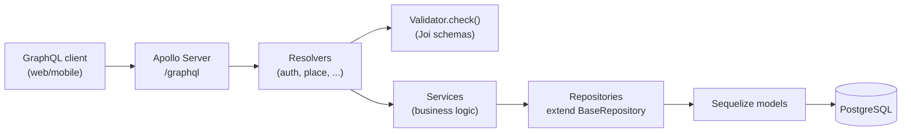
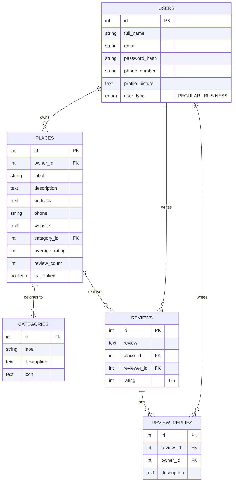

# Architecture

## Backend layering

The existing code already follows one consistent flow. Keep every new feature on this
same shape — it's the single most valuable thing to protect as the project grows:

Rules implied by the existing code, worth writing down so they stay rules instead of
accidents:
- **Resolvers** parse args, call `requireAuth`/`requireOwner`, validate input via
  `Validator.check(schema, input)`, delegate to a service, wrap the result in
  `SuccessResponse.send(...)`, and translate thrown errors into `GraphQLError`. They do
  not talk to models or repositories directly.
- **Services** hold business logic and orchestration (e.g. "does this place exist
  before I update it") and own the one repository they need. They return
  models/DTOs, not GraphQL-shaped envelopes.
- **Repositories** are the only layer that touches Sequelize. New repositories extend
  `BaseRepository<InputInterface, ModelInterface>` and add only the query methods a
  generic repo can't express — don't reimplement `findByPk`/`create`/etc.
- **Validators** are Joi schemas built from the shared primitives in `schemas.ts`.
  Every mutation input gets a schema, even a thin one.

## Why `@apollo/subgraph` / `buildSubgraphSchema`

`schema/index.ts` composes the graph with `buildSubgraphSchema([{typeDefs, resolvers}, ...])`
from `@apollo/subgraph` — this is Apollo Federation's subgraph API, normally used when
multiple independently-deployed services each own part of a graph behind a gateway.
Here it's being used with a single process and no gateway, purely as a way to let each
feature (`auth`, `place`, ...) `extend type Query`/`extend type Mutation` independently
and merge cleanly. That's a legitimate use and it's cheap to keep — but it's worth
being deliberate about it: if there's no near-term plan to split into real federated
services, a plain `makeExecutableSchema` from `@graphql-tools/schema` gives the same
"multiple files extend the root types" ergonomics without importing federation
semantics (`@key`, entity resolution, etc.) that aren't being used and could confuse
future contributors into thinking this is a federated architecture. Not urgent — just
flag it as an intentional-or-not decision worth confirming.

## Data model

### Current (implemented as migrations)

Every table above already has `created_at`/`updated_at`/`deleted_at` (soft delete)
via `paranoid: true` — keep that convention for every new table too, it's the reason
"delete" in the Figma designs (delete review, remove saved place, delete account) can
be a safe, reversible operation instead of a destructive one.

### Proposed additions (to satisfy the Figma scope — see doc 1's feature table)

```mermaid
erDiagram
    SAVED_PLACES {
        int id PK
        int user_id FK
        int place_id FK
        enum list_type "SAVED | WANT_TO_VISIT | FAVORITE"
    }
    REVIEW_VOTES {
        int id PK
        int review_id FK
        int user_id FK
        boolean helpful
    }
    NOTIFICATIONS {
        int id PK
        int user_id FK
        string type
        text payload
        boolean read
    }
    BADGES {
        int id PK
        string label
        text icon
        text criteria
    }
    USER_BADGES {
        int id PK
        int user_id FK
        int badge_id FK
        datetime earned_at
    }
    SESSIONS {
        int id PK
        int user_id FK
        string refresh_token_hash
        string device_label
        datetime last_used_at
        datetime revoked_at
    }
    PLACE_HOURS {
        int id PK
        int place_id FK
        int day_of_week
        time opens_at
        time closes_at
    }
    MEDIA {
        int id PK
        string owner_type "PLACE | REVIEW | USER"
        int owner_id
        text url
        string kind "PHOTO | AVATAR | COVER"
    }
```

Notes on the additions:
- **`SAVED_PLACES`** is the backing table for "Saved" tab, the heart-toggle on
  business cards, and the "Want to Visit / Favorites" filters — one table, `list_type`
  enum distinguishes the tab, avoids three separate join tables.
- **`REVIEW_VOTES`** backs the "helpful" vote count; store one row per (user, review)
  so a user can't vote twice, and derive the displayed count rather than storing a
  mutable counter that can drift.
- **`SESSIONS`** is what makes refresh-token revocation and the Settings "active
  sessions" list possible — store a hash of the refresh token, not the token itself.
- **`MEDIA`** is a single polymorphic table for the three places images show up
  (place photos, review photos, user avatar/cover) rather than three near-identical
  tables — pairs with an actual object-storage decision (see doc 6).
- Add `price_range` (`enum $/$$/$$$`) directly onto `PLACES` rather than a new table.

## Planned: `signUpBusiness` (atomic account + place creation)

**New scope, surfaced 2026-08-12** while designing Phase 4's Auth screens (see
[04-roadmap.md](./04-roadmap.md) Phase 4 and
[05-frontend-plan.md](./05-frontend-plan.md)'s "Business-owner signup" section) —
not yet built, recorded here so the shape is decided before implementation starts.

Business-owner signup needs to create the `User` (`userType: BUSINESS`) and their
first `Place` **atomically in one transaction**, not as two chained calls to the
existing `signUp` + `createPlace` mutations — chaining them risks a business-type
user left with no place if the caller drops off between steps. A new mutation,
`signUpBusiness`, does both:

- **Input**: the existing `InputAuthSignUp` fields minus `userType` (implied
  `BUSINESS`) — `name`, `email`, `password` — plus the place fields `createPlace`
  already takes: `label`, `description`, `address`, `phone`, `website`,
  `categoryId`, `priceRange`.
- **Output**: same shape `signUp` already returns (tokens + `User`) plus the
  created `Place`.
- **Validator**: a new Joi schema, per convention — not a thin wrapper around the
  two existing schemas, since some fields (e.g. `categoryId`) are required here in
  a way `createPlace`'s standalone schema may not enforce identically.

**Open implementation question, not resolved here**: `CLAUDE.md`'s service rule is
"own exactly one repository each" — this mutation's orchestration spans two
repositories (`UserRepository`, `PlaceRepository`). Two ways to keep that rule
intact rather than reaching straight for both repositories from a new service:
1. A new orchestration-only service (e.g. `BusinessOnboardingService`) that calls
   the *existing* `AuthService`/`UserService` and `PlaceService` methods rather
   than touching either repository directly — but those methods would need to
   accept and pass through a shared Sequelize transaction, the same way review
   creation already threads a transaction through to keep `Place.averageRating`/
   `reviewCount` recomputation atomic with the review write (an existing
   precedent worth reusing here, not inventing a new transaction pattern).
2. Or accept a one-off exception to the one-repository rule for this specific
   orchestration service, if threading a shared transaction through two existing
   services turns out awkward in practice.
Worth settling once this is actually picked up for implementation, not guessed at
now.

## Planned: `Category` cover image + live business-count/avg-rating

**New scope, surfaced 2026-08-12** while designing Phase 4's Categories screen
(see [04-roadmap.md](./04-roadmap.md) Phase 4) — reverses an earlier decision on
the same ticket to ship category cards without these fields, once matching the
Figma design exactly (cover photo + "N businesses · X★ avg" per card) turned out
to be what was actually wanted, not just a visual reference to loosely adapt.
**`coverImageUrl` is now built** (2026-08-13); `businessCount`/`avgRating` below
are still planned, not yet implemented.

- ~~**`coverImageUrl: String`**~~ **Done.** New nullable `cover_image_url` column
  on `providers_category` (migration `20260813120000-add-cover-image-url-to-category.js`)
  + matching GraphQL field, resolved via default field resolution off the model
  instance (no field resolver needed). Categories are migration/seed-managed
  ("no mutations" per `CLAUDE.md`) and stay that way — no mutation was added.
  **Not yet seeded**: the field exists and resolves (verified `null` for all 5
  existing categories via a live query) but no actual URLs have been set —
  populating real per-category images is a content decision, not part of this
  addition. Also worth noting while touching this table: the current seed data
  only has 5 categories (Restaurant, Cafe, Bar, Hotel, Gym), not the 10 the
  Phase 4 frontend design was built against (Restaurants, Cafés, Hotels,
  Shopping, Healthcare, Education, Fitness, Beauty & Wellness, Entertainment,
  Professional Services) — a real gap to resolve before the Categories screen
  is wired to real data, not addressed by this change.
- **`businessCount: Int` / `avgRating: Float`** — computed **live at query time**,
  not materialized/cached columns. This matches the *existing* precedent already
  set by `Place.averageRating`/`reviewCount`, which `CLAUDE.md` documents as
  "recomputed from source... never incrementally adjusted" — same philosophy
  applied one level up (categories aggregating over places, instead of places
  aggregating over reviews). Given there are only 10 categories, a single grouped
  query is cheap: `COUNT`/`AVG` over non-deleted `Place`s joined on `category_id`,
  grouped by category. Both `categories()` and `category(id)` need these fields —
  the category-detail screen's banner copy ("N businesses · X★ average rating")
  uses them too, not just the browse-grid cards.
- **Layering — no exception needed, unlike `signUpBusiness` above**: this stays
  inside `CategoryRepository`'s ownership. `BaseRepository` already exposes
  `rawQuery` (`docs/02-current-state.md` lists it among the generic repo's
  methods) — the joined aggregate query runs through that, so `CategoryService`
  still owns exactly one repository, no cross-repository orchestration question
  like `signUpBusiness` had.
- **Open design note, worth being explicit about rather than silently picking
  one**: `avgRating` here is an *average of each place's already-averaged
  rating* (average-of-averages), not a true weighted average across every
  individual review in the category. Simpler to compute and matches what the
  Figma design almost certainly intended, but worth knowing it can diverge
  slightly from a places-weighted-by-review-count calculation if that precision
  ever matters later.

### Also needed: platform-wide stats (`totalPlaces`/`totalReviews`)

**Addendum, surfaced 2026-08-12** after this same ticket was reopened to restore
the Categories screen's "56,700+ Total Businesses / 10 Categories / 14M+
Reviews" stats row — same reasoning as above, but platform-wide rather than
per-category, so it doesn't fit inside `Category`.

- A new top-level query, e.g. `platformStats: PlatformStatsResponse { data:
  { totalPlaces: Int, totalReviews: Int } }` — `totalPlaces` is `COUNT` over
  non-deleted `Place`, `totalReviews` is `COUNT` over non-deleted `Review`.
  "Categories" doesn't need this query at all — it's already real today via
  `categories().data.length`, no backend change for that number.
- Same **live, not materialized** philosophy as the rest of this doc. Given
  this is two unrelated `COUNT`s (not a join), it doesn't obviously belong to
  either `CategoryRepository` or `PlaceRepository`/`ReviewRepository` alone —
  simplest is a small dedicated `PlatformStatsService` composing the two
  existing repositories' own `count()` methods (already part of
  `BaseRepository`, per `docs/02-current-state.md`) rather than adding a new
  cross-domain repository. Each repository still owns exactly one table's
  concerns; the service only orchestrates two independent reads, not a shared
  write transaction, so this doesn't carry the same complication
  `signUpBusiness` above does.
- Not yet built — recorded here so the shape is decided before implementation
  starts, same as everything else in this section.

## Planned: Place Detail follow-ups (`ReviewReply.createdAt`, review sort, rating breakdown)

**New scope, surfaced 2026-08-13** while designing Phase 4's Place Detail screen
(ticket `06-place-detail-review.md`) against a real, complete Figma design for it.
Three small, independent additions. **`ReviewReply.createdAt` is now built**
(2026-08-13); the other two are still planned, not yet implemented.

- ~~**`ReviewReply.createdAt: DateTime`**~~ **Done**, typed `String` not
  `DateTime` — this schema has no `DateTime` scalar anywhere (checked); every
  existing date field (`Session.createdAt`/`lastUsedAt`) is plain `String`, so
  `ReviewReply.createdAt` matches that convention instead of introducing a new
  one. The underlying row already had `created_at` (`ModelTimestampExtend`,
  `timestamps: true` + `underscored: true` on the model) — no migration needed,
  no field resolver needed either, resolves via GraphQL's default field
  resolution off the model instance exactly like `Session.createdAt` does.
  Verified live: renders as a raw epoch-millisecond string (e.g.
  `"1786588033234"`), not an ISO date string — confirmed this is `Session`'s
  existing behavior too, not a defect introduced here. A real frontend will
  need to `new Date(Number(createdAt))` to format it, same as it already has to
  for sessions.
- **`placeReviews(placeId, first, after, sort: ReviewSortEnum)`** — currently
  has no sort argument at all. A new `ReviewSortEnum` (`RECENT`/`HELPFUL`)
  mirrors the existing `PlaceSortEnum` pattern on `listPlaces` — `RECENT` orders
  by `created_at DESC`, `HELPFUL` by the existing `helpfulCount`. Same
  cursor-pagination shape, just a new ordering.
- **Rating breakdown** — a per-place count of reviews at each star value
  (5★→1★), for a bar-chart-style breakdown on the detail page. Same "live,
  not materialized" treatment as `Place.averageRating` itself and as
  Categories' `businessCount`/`avgRating` above: a single grouped `COUNT` query
  (`GROUP BY rating` over that place's non-deleted `Review`s), likely exposed
  as a new `Place.ratingBreakdown: [RatingBreakdownEntry]` field
  (`{ stars: Int, count: Int }`) resolved through `ReviewRepository`'s existing
  `rawQuery` capability — no cross-repository complication, same reasoning as
  Categories' stats.

None of these are built yet — recorded here so the shape is decided before
implementation starts, same as everything else in this section.

## GraphQL schema design principles going forward

- **One `typeDefs`/`resolvers` pair per domain concept**, `extend type Query`/`Mutation`
  from each, composed in `schema/index.ts` — already the pattern, just keep doing it
  for `category`, `review`, `saved`, `notification`, etc.
- **Every field a screen needs should resolve through GraphQL, not bespoke REST.** The
  Figma dashboards (KPI cards, charts, sentiment breakdown) are read-heavy aggregation
  queries — model them as GraphQL queries with dedicated response types
  (`BusinessDashboardResponse`) backed by service-layer aggregation, not by having the
  frontend stitch together three separate queries.
- **Use the `PageInfoInterface`/`edges` shape that already exists** in
  `SuccessResponse` for any list endpoint (Discover feed, notifications, reviews) —
  it's already half-built, don't invent a second pagination convention.
- **Keep resource-ownership checks in the service layer**, next to the fetch that
  proves the resource exists (fixes issue #2 in doc 2 and prevents it from recurring
  in `review`/`review_reply` resolvers, which have the exact same shape).
