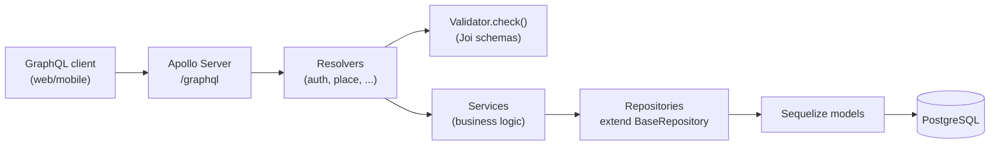
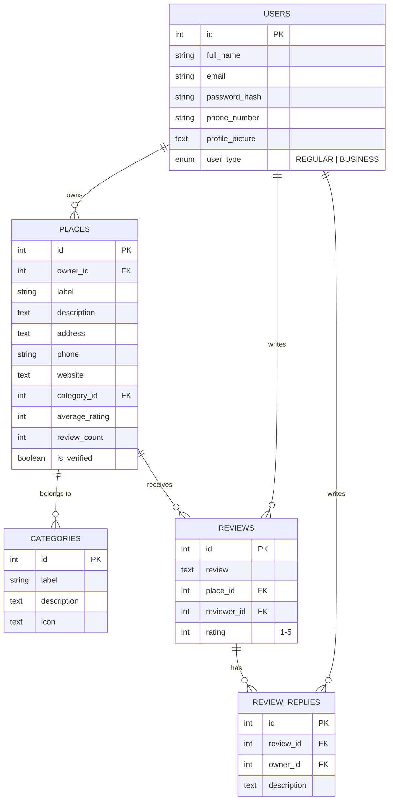

# Architecture

## Backend layering

The existing code already follows one consistent flow. Keep every new feature on this
same shape — it's the single most valuable thing to protect as the project grows:

Rules implied by the existing code, worth writing down so they stay rules instead of
accidents:
- **Resolvers** parse args, call `requireAuth`/`requireOwner`, validate input via
  `Validator.check(schema, input)`, delegate to a service, wrap the result in
  `SuccessResponse.send(...)`, and translate thrown errors into `GraphQLError`. They do
  not talk to models or repositories directly.
- **Services** hold business logic and orchestration (e.g. "does this place exist
  before I update it") and own the one repository they need. They return
  models/DTOs, not GraphQL-shaped envelopes.
- **Repositories** are the only layer that touches Sequelize. New repositories extend
  `BaseRepository<InputInterface, ModelInterface>` and add only the query methods a
  generic repo can't express — don't reimplement `findByPk`/`create`/etc.
- **Validators** are Joi schemas built from the shared primitives in `schemas.ts`.
  Every mutation input gets a schema, even a thin one.

## Why `@apollo/subgraph` / `buildSubgraphSchema`

`schema/index.ts` composes the graph with `buildSubgraphSchema([{typeDefs, resolvers}, ...])`
from `@apollo/subgraph` — this is Apollo Federation's subgraph API, normally used when
multiple independently-deployed services each own part of a graph behind a gateway.
Here it's being used with a single process and no gateway, purely as a way to let each
feature (`auth`, `place`, ...) `extend type Query`/`extend type Mutation` independently
and merge cleanly. That's a legitimate use and it's cheap to keep — but it's worth
being deliberate about it: if there's no near-term plan to split into real federated
services, a plain `makeExecutableSchema` from `@graphql-tools/schema` gives the same
"multiple files extend the root types" ergonomics without importing federation
semantics (`@key`, entity resolution, etc.) that aren't being used and could confuse
future contributors into thinking this is a federated architecture. Not urgent — just
flag it as an intentional-or-not decision worth confirming.

## Data model

### Current (implemented as migrations)

Every table above already has `created_at`/`updated_at`/`deleted_at` (soft delete)
via `paranoid: true` — keep that convention for every new table too, it's the reason
"delete" in the Figma designs (delete review, remove saved place, delete account) can
be a safe, reversible operation instead of a destructive one.

### Proposed additions (to satisfy the Figma scope — see doc 1's feature table)

Notes on the additions:
- **`SAVED_PLACES`** is the backing table for "Saved" tab, the heart-toggle on
  business cards, and the "Want to Visit / Favorites" filters — one table, `list_type`
  enum distinguishes the tab, avoids three separate join tables.
- **`REVIEW_VOTES`** backs the "helpful" vote count; store one row per (user, review)
  so a user can't vote twice, and derive the displayed count rather than storing a
  mutable counter that can drift.
- **`SESSIONS`** is what makes refresh-token revocation and the Settings "active
  sessions" list possible — store a hash of the refresh token, not the token itself.
- **`MEDIA`** is a single polymorphic table for the three places images show up
  (place photos, review photos, user avatar/cover) rather than three near-identical
  tables — pairs with an actual object-storage decision (see doc 6).
- Add `price_range` (`enum $/$$/$$$`) directly onto `PLACES` rather than a new table.

## GraphQL schema design principles going forward

- **One `typeDefs`/`resolvers` pair per domain concept**, `extend type Query`/`Mutation`
  from each, composed in `schema/index.ts` — already the pattern, just keep doing it
  for `category`, `review`, `saved`, `notification`, etc.
- **Every field a screen needs should resolve through GraphQL, not bespoke REST.** The
  Figma dashboards (KPI cards, charts, sentiment breakdown) are read-heavy aggregation
  queries — model them as GraphQL queries with dedicated response types
  (`BusinessDashboardResponse`) backed by service-layer aggregation, not by having the
  frontend stitch together three separate queries.
- **Use the `PageInfoInterface`/`edges` shape that already exists** in
  `SuccessResponse` for any list endpoint (Discover feed, notifications, reviews) —
  it's already half-built, don't invent a second pagination convention.
- **Keep resource-ownership checks in the service layer**, next to the fetch that
  proves the resource exists (fixes issue #2 in doc 2 and prevents it from recurring
  in `review`/`review_reply` resolvers, which have the exact same shape).
