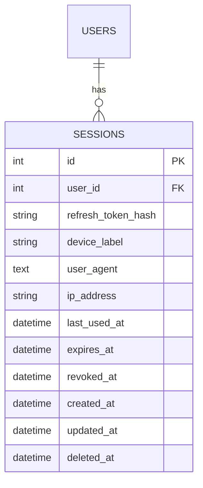

# Phase 1 Spec: Backend Hardening

**Status: DRAFT — awaiting your green signal. Nothing in here is implemented yet.**

Source: [docs/04-roadmap.md](../04-roadmap.md) Phase 1, itemized from bugs/gaps found in
[docs/02-current-state.md](../02-current-state.md). This spec exists so the shape of
the change is agreed before code gets written — flag anything you'd cut, change, or
sequence differently and I'll revise before touching a single file.

## Decisions locked in before writing this spec

| Item | Decision |
|---|---|
| `signOut`/`forgotPassword`/`changePassword`/`confirmForgotPassword` | **Implement now** (not stripped from schema) |
| `userTypedefs.ts` | **Delete** — dead, unwired, references an undefined type |
| Sessions | **Full design** in this doc (table, issuance, rotation, revocation, listing) — you'll split it into smaller implementation tickets afterward |

Everything below expands those three, plus the three smaller mechanical fixes.

---

## 1. Fix the auth identity field mismatch (`id` vs `userid`)

**Problem:** `context.user` is populated in [server.ts](../../src/server.ts:51) from
`verifyJwt(token)`, which returns the raw JWT payload — `{ userid, userType, iat, exp }`
([jwt.ts](../../src/utils/jwt.ts:7)). But `ContextInterface.user` is typed as the full
`UserInterface` (email, fullName, passwordHash, etc.) — a type that's never actually
true at runtime, since only the JWT payload ever gets assigned there. `authMeUser`
([authResolver.ts:74](../../src/graphql/resolvers/authResolver.ts:74)) calls
`user.id`, which is `undefined`, while `placeResolver.createPlace`
([placeResolver.ts:24](../../src/graphql/resolvers/placeResolver.ts:24)) correctly
uses `user.userid`. Two call sites, two different (and only one correct) assumptions
about the same object.

**Design:**
- Standardize the field name to **`id`** (matches the DB column and every other
  interface in the codebase).
- Introduce a dedicated, honest type for what's actually on `context.user` — it is a
  decoded JWT payload, not a hydrated user record:
  ```ts
  // src/interfaces/authInterface.ts
  export interface AuthTokenPayload {
    id: string;
    userType: UserTypeEnum;
  }
  ```
- Change `ContextInterface.user?: UserInterface` → `ContextInterface.user?: AuthTokenPayload`.
- `signToken(id, userType)` in [jwt.ts](../../src/utils/jwt.ts:7) — rename the `userid`
  param/payload key to `id` (currently `jwt.sign({ userid, userType }, ...)`).
- Update every call site that reads `user.userid` (currently just
  `placeResolver.createPlace`) to `user.id`.
- `requireAuth`/`requireOwner` in [auth.ts](../../src/utils/auth.ts) return
  `AuthTokenPayload` instead of the current implicit `UserInterface`.

**Acceptance criteria:**
- `authMeUser` returns the correct user for a valid access token (manually verified via
  the GraphQL playground: login, copy access token, call `authMeUser` with `Authorization: Bearer <token>`).
- No remaining reference to `.userid` anywhere in `src/`.

---

## 2. Place resource-ownership enforcement

**Problem:** `requireOwner` ([auth.ts:19](../../src/utils/auth.ts:19)) only checks
`user.userType === BUSINESS` — a role check, not a resource check. `updatePlace` and
`deletePlace` ([placeResolver.ts:40-83](../../src/graphql/resolvers/placeResolver.ts))
call it but never compare the caller's identity to the place's `ownerId`. Today, any
business-type account can edit or delete *any* business's listing, not just their own.

**Design** (per the "ownership checks live in the service layer, next to the fetch
that proves the resource exists" principle in
[03-architecture.md](../03-architecture.md)):
- `PlaceService.updatePlace` and `PlaceService.delete` start taking the requesting
  user's `id` as a parameter.
- After the existing `getPlaceById` existence check, add:
  ```ts
  if (existingPlace.ownerId !== requestingUserId) {
    throw new GraphQLError("You do not own this place.", {
      extensions: { code: "FORBIDDEN", status: 403 },
    });
  }
  ```
- `placeResolver.updatePlace`/`deletePlace` pass `user.id` (from item 1's fixed
  `requireAuth`) through to the service call.
- `requireOwner`'s existing role check stays as-is and still gates `createPlace` (no
  existing resource to check ownership against on create).

**Acceptance criteria:**
- Business account A can no longer update or delete a place owned by business account B
  (manually verified: create a place as user A, attempt `updatePlace`/`deletePlace` as
  user B, expect a `FORBIDDEN`/403 error).
- Business account A can still update/delete their own place.
- Regular (`REGULAR`) accounts still get the existing role-based rejection before the
  ownership check ever runs.

---

## 3. Standardize the GraphQL error `extensions` shape

**Problem:** `extensions.status` is inconsistently typed — a number in some resolvers
(`status: 401`), a string in others (`status: "404"`) — see
[authResolver.ts:58](../../src/graphql/resolvers/authResolver.ts:58) vs.
[placeResolver.ts:35](../../src/graphql/resolvers/placeResolver.ts:35). Every resolver
also hand-rolls the same `new GraphQLError(message, { extensions: {...} })` boilerplate.

**Design:**
- `status` is always a `number` (matches HTTP semantics and the majority of existing
  call sites).
- Add a small helper next to `SuccessResponse` so future resolvers don't hand-roll this:
  ```ts
  // src/helpers/errorHelper.ts
  export const throwError = (message: string, code: string, status: number): never => {
    throw new GraphQLError(message, { extensions: { code, status } });
  };
  ```
- Replace every existing `throw new GraphQLError(...)` call site in `authResolver.ts`
  and `placeResolver.ts` with `throwError(...)`.

**Acceptance criteria:**
- No `extensions.status` value is a string anywhere in `src/`.
- Every thrown GraphQL error in the codebase goes through `throwError`.

---

## 4. Delete `userTypedefs.ts`

**Problem:** [userTypedefs.ts](../../src/graphql/typeDefs/userTypedefs.ts) defines
`createUser`/`updateUser`/`deleteUser`/`users`/`user`, but it's never passed into
`buildSubgraphSchema` in [schema/index.ts](../../src/graphql/schema/index.ts) — none of
it is reachable — and it references a `SingleUser` type that's never defined anywhere
(would fail schema composition if it were ever wired in).

**Design:** delete the file. No user-management feature is in the near-term roadmap
(see [04-roadmap.md](../04-roadmap.md)); if/when one is planned, it gets specified and
built fresh rather than resurrecting this.

**Acceptance criteria:** file removed, `npm run build` still passes (confirms nothing
actually imported it).

---

## 5. Implement the missing auth mutations

Currently declared in [authTypedefs.ts:92-98](../../src/graphql/typeDefs/authTypedefs.ts)
with no resolver behind any of them.

### 5a. `changePassword(input: { previousPassword, newPassword, confirmNewPassword })`

- Requires `requireAuth`.
- Joi schema: `confirmNewPassword` must equal `newPassword` (`Joi.ref('newPassword')`);
  reuse existing password strength rules if any exist, otherwise a minimum-length rule
  consistent with signup.
- `AuthService.changePassword`: fetch the user by `id` from context, `bcrypt.compare`
  against `previousPassword`; on mismatch, throw `UNAUTHENTICATED`/401. On success,
  hash and persist `newPassword`.
- **Security side-effect:** revoke all of the user's sessions except the one making
  this request (see §6) — a password change should kick out anyone else holding a
  stolen refresh token. This is the first concrete tie between auth mutations and the
  sessions table.

### 5b. `forgotPassword(input: { email })`

- No auth required (the caller isn't logged in).
- Look up user by email. **Always return the same generic `Message`** ("If that email
  exists, a reset code has been sent.") whether or not the user exists — don't leak
  which emails are registered.
- If found: generate a random verification code, store a hash of it plus an expiry
  (e.g. 15 minutes) — needs a small new table, `password_reset_tokens`
  (`id, user_id FK, code_hash, expires_at, used_at, created_at`) — a single-use,
  short-lived credential, structurally the same idea as a session but intentionally
  kept separate since it's not an auth session.
- **Open flag for your review:** there is no email-sending capability anywhere in this
  codebase today (no nodemailer/SES/SendGrid dependency). Actually delivering the code
  by email is real, separate infra work. For this phase, I'd propose the mutation does
  everything *except* send an email — it generates and persists the code and (in
  non-production only) logs/returns it so the flow is testable — and email delivery
  becomes its own follow-up ticket. Say if you'd rather pull in an email provider now
  instead.

### 5c. `confirmForgotPassword(input: { newPassword, verificationCode, email })`

- No auth required (this *is* the auth mechanism, in place of a password).
- Look up the user by email, then the most recent non-expired, unused
  `password_reset_tokens` row for that user; compare `verificationCode` against the
  stored hash. On any mismatch/expiry, a single generic `UNAUTHENTICATED` error (don't
  distinguish "wrong code" from "expired" from "no such user" in the message).
- On success: hash and persist `newPassword`, mark the reset token `used_at = now()`,
  and **revoke all sessions for that user** (same rationale as 5a, more important here
  since a password reset often follows a suspected compromise).

### 5d. `signOut(input: { refreshToken })`

- Requires `requireAuth` (the access token must still be valid — a fully logged-out
  client has nothing to call this with, which is fine, it just means it's already
  effectively signed out).
- Hash the provided `refreshToken`, find the matching session row for
  `context.user.id`, set `revoked_at = now()`. Return a generic success `Message`
  whether or not a matching session was found (same anti-enumeration reasoning as
  `forgotPassword`).
- **Known limitation, explicitly accepted:** the access token itself is a stateless
  JWT and stays valid until it naturally expires (short-lived, per
  `JWT_ACCESS_EXPIRES_IN`). `signOut` revokes the ability to mint *new* access tokens
  via this refresh token — it does not instantly invalidate one already issued. Worth
  saying out loud rather than implying "signed out" means "immediately locked out
  everywhere."

**Acceptance criteria (5a-5d):**
- Each mutation has a Joi validator, a service method, and a resolver, following the
  existing layering.
- `changePassword` and `confirmForgotPassword` both demonstrably revoke other sessions
  (manually verified once §6 exists).
- No mutation leaks whether a given email/token is valid via response differences.

---

## 6. Sessions — full design

This is the deep spec you asked for; expect to split this into several smaller tickets
before building it.

### Why

Refresh tokens today are signed and returned to the client
([jwt.ts:15](../../src/utils/jwt.ts:15)) but never persisted anywhere. That means:
there's no way to revoke one server-side, no way to satisfy the Settings screen's
"active sessions with revoke" feature (see
[01-vision-and-scope.md](../01-vision-and-scope.md)), and — a gap the roadmap bullet
doesn't say out loud but that falls out of actually specifying "issuance" — **there is
currently no mutation that lets a client exchange a refresh token for a new access
token at all.** Without persisting sessions and adding that exchange, the refresh
token that's already being issued today is dead weight. This spec treats "add
issuance/revocation" as including that exchange, since revocation is meaningless
without something to revoke it *from*.

### Data model

New table, `providers_sessions`, matching the project's existing conventions
(`paranoid`, `underscored`, explicit `field:` mappings):



- **`refresh_token_hash`**: SHA-256 of the refresh token, not bcrypt. Bcrypt is for
  low-entropy secrets (passwords) and is intentionally slow with random salt-per-call,
  which makes "look up a row by this exact hash" impossible. A refresh token is already
  high-entropy (a signed JWT), so a fast, deterministic hash is the right tool — it
  still means a stolen database dump doesn't hand over usable refresh tokens.
- **`expires_at`**: mirrors the JWT's own `exp` (derived from
  `JWT_REFRESH_EXPIRES_IN`), stored redundantly so "list active sessions" can filter
  without decoding every token.
- **`device_label`/`user_agent`/`ip_address`**: best-effort, populated from the request
  context at issuance time (`req.headers['user-agent']`, `req.ip`). `device_label` can
  start as a simple parse of the user-agent string (e.g. "Chrome on macOS") — no need
  for a real device-fingerting library in this phase.
- A session with `revoked_at IS NULL AND expires_at > now()` is **active**; anything
  else is not returned by the "list active sessions" query.

`ContextInterface` needs `ip` alongside its existing `headers` field so services can
read it without reaching into Express/`IncomingMessage` directly:

```ts
export interface ContextInterface {
  authorization?: string;
  operationName?: string;
  user?: AuthTokenPayload;
  headers?: IncomingHttpHeaders;
  ip?: string;
}
```

### Flows

**Issuance (signup & login):** After `signToken` produces `{ accessToken, refreshToken }`,
create a `Session` row (hash of `refreshToken`, `user_id`, `device_label`/`user_agent`/
`ip_address` from context, `expires_at` computed from the refresh token's own expiry).
Both `AuthService.signUp` and `AuthService.login` get this — signup already logs the
user in by returning tokens, so it needs a session row exactly like login does.

**Renewal — new mutation, `refreshAccessToken(input: { refreshToken })`:**
1. Verify the JWT signature/expiry against `JWT_REFRESH_SECRET` (note: today's
   `verifyJwt` in [jwt.ts](../../src/utils/jwt.ts:26) hardcodes `JWT_ACCESS_SECRET` —
   this needs a sibling `verifyRefreshJwt` using the refresh secret).
2. Hash the token, look up the `Session` row; must exist, not be revoked, not be
   expired. Any failure → generic `UNAUTHENTICATED`.
3. **Rotate**: revoke the old session (`revoked_at = now()`), issue a brand-new
   access+refresh token pair, create a new session row for it. Rotation means a
   refresh token can only ever be used once to renew — if a stolen, already-used token
   is replayed, it fails outright, which is the standard defense for refresh-token
   theft. (Flag if you'd rather skip rotation for simplicity and reuse the same
   refresh token until its natural expiry — it's a real complexity/security
   trade-off, not a default I'd make silently.)
4. Update `last_used_at` on the new row.

**Revocation:**
- `signOut` (§5d) revokes the one session matching the provided refresh token.
- `changePassword`/`confirmForgotPassword` (§5a/5c) revoke every session for that user
  *except* (for `changePassword`, which is authenticated) the one making the current
  request.
- New mutation `revokeSession(sessionId: Int!)`, authenticated: revoke a specific
  session by id, but only if `session.userId === context.user.id` (same
  resource-ownership shape as §2 — reuse the pattern, not a new one).

**Listing — new query, `activeSessions`:** authenticated; returns every session for
`context.user.id` where `revoked_at IS NULL AND expires_at > now()`, ordered by
`last_used_at DESC`. Fields: `id`, `deviceLabel`, `ipAddress`, `createdAt`,
`lastUsedAt`. **Non-goal for this phase:** flagging *which* row is "this current
device" in the list — that needs the client to know its own session id, which would
mean threading a `sessionId` back through the login/refresh response and the frontend
storing it. Worth doing when the Settings screen is actually built (Phase 7); no
frontend consumes this yet, so it's premature to design that round-trip now.

### Out of scope for this phase (explicitly, not silently)

- Pruning/deleting expired session rows (a scheduled job) — rows just accumulate for
  now; cheap to add later, not worth building before there's real traffic to prune.
- Any notification ("new sign-in from a new device") — ties to the Notifications
  system, which doesn't exist yet (Phase 5).
- Geo-IP lookup for a human-readable location on each session.

**Acceptance criteria:**
- Login/signup create a session row with a correctly-hashed token.
- `refreshAccessToken` with a valid, unexpired, unrevoked token returns a new pair and
  invalidates the old one (replaying the old refresh token after renewal fails).
- `signOut`, `changePassword`, and `confirmForgotPassword` demonstrably revoke the
  sessions they're supposed to (manually verified: revoke, then attempt
  `refreshAccessToken` with the revoked token, expect failure).
- `activeSessions` returns only genuinely active sessions for the caller, never
  another user's.

---

## Suggested build sequencing (for when tickets get split out)

Roughly the dependency order, not a mandate:

1. §1 (identity field fix) — small, and §2/§5/§6 all read `context.user.id`, so get the
   type honest first.
2. §3 (error helper) + §4 (delete dead file) — trivial, no dependencies, do anytime.
3. §2 (place ownership) — depends only on §1.
4. §6 (sessions table + issuance + renewal + revocation query/mutations) — the biggest
   single piece; §5's password-flow mutations depend on it existing (they revoke
   sessions), so it likely needs to land first or in the same batch.
5. §5 (auth mutations) — depends on §6 for the "revoke other sessions" side-effect.

## Non-goals for this entire spec

- No frontend work — nothing here has a UI yet.
- No changes to `Place`/`Review`/`Category` domain logic beyond the ownership check in §2.
- No email-sending integration (flagged as an open question in §5b, not decided here).
- No rate limiting on the new auth mutations — real concern (especially
  `forgotPassword`/`confirmForgotPassword` are classic brute-force targets), but that's
  [06-quality-and-ops.md](../06-quality-and-ops.md) territory, not this spec's.
